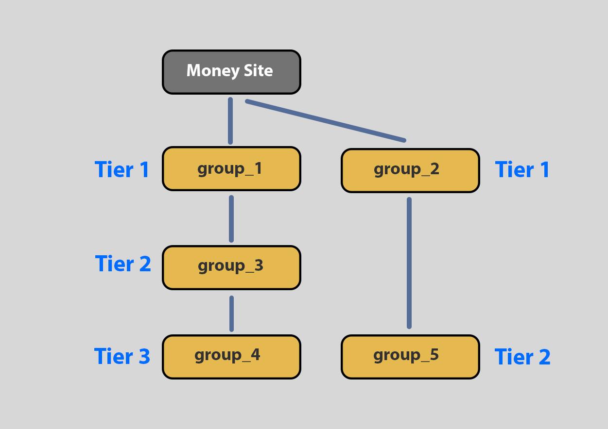

# Tiers

Tier is the level or depth of a backlink. Using SEO NEO diagrams as an analogy, the level of the link group is the tier number (counting from 1 after your money site).

When a campaign runs, the software first executes tasks for each group in ascending order (First Tier 1, then Tier 2, Tier 3 ... etc).

This means that generated links from a higher tier are used on lower tiers.

Multiple tiers create a SEO strategy with bigger depth and more natural link profile for search engines.

<figure><figcaption>
Tier levels example
</figcaption></figure>

