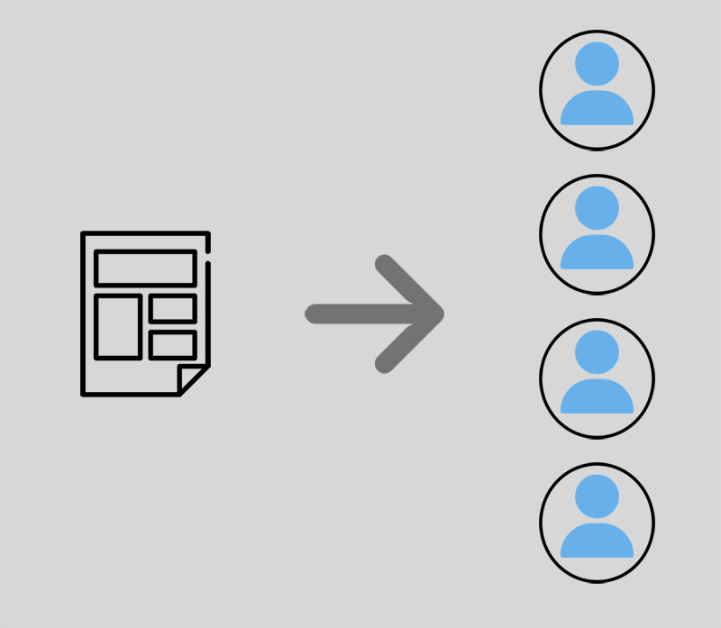

# 📋 Account Templates

### Video: Account Templates Fundamentals



### Introduction

An account template is a template that is used as a guideline on how SEO Neo creates new accounts.

When a new account is created (registration), SEO Neo will need information on how to register this account. This information includes:

**Email details**: (username, password, mail server, SSL etc.)

**Account creation details**: the username and password format that will be used to register the new account. This information uses [spintax format](../../additional-information/glossary/spintax-format.md) to create different variations.

<figure><figcaption>
Account template is a templates on how accounts are created.
</figcaption></figure>

### Account Templates Window Overview

<figure><figcaption>
Main sections overview to manage your Account Templates
</figcaption></figure>

Account Templates main screen is divided into three sections.

1\) **Account templates list** : where all your account templates files are listed and stored. You can create, delete and rename your account templates from here.

2\) **Template Emails**: you can manage all emails for selected account template from here.

3\) **Template Details**: here you enter username and password for selected account template.
