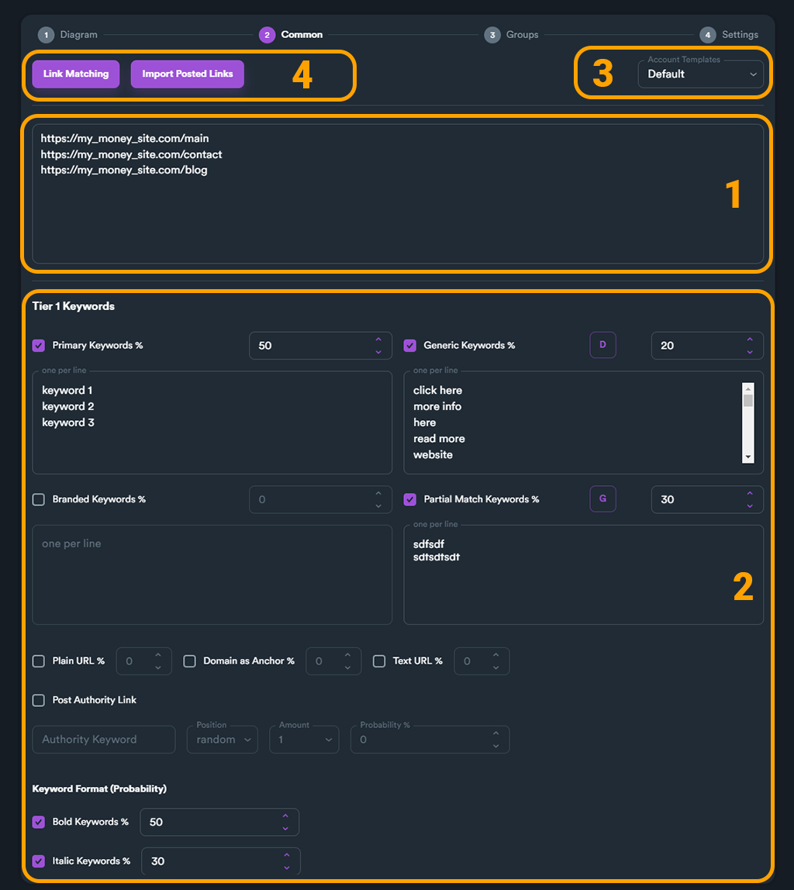

# 2 - Common

On this section you can enter your target urls (money site URLs), set all keywords, select your account template and match your keywords with URLs.

In general, in this section you enter all campaign data that is common for the whole campaign.

<figure><figcaption></figcaption></figure>

#### **(1)** **Money Site URL Links**

Here you enter all URLs that you want your campaign to target. You can enter multiple URLs (one per line).

<figure><figcaption></figcaption></figure>

**(2)** **Keywords**

Here you set all keyword settings for your campaign. You can enable which keyword types you want to enable.

<figure><figcaption></figcaption></figure>

In the example above we have enabled two keyword types (Primary keywords and Generic keywords).

We have set 50% for **Primary keywords** and 50% for **Generic keywords**.

We have also entered 3 Primary keywords and 3 Generic keywords.

#### **(3)** **Account Template**

An account template is a requirement for a campaign. To select an account template click on drop-down menu (located on top-right) and select an account template.

<figure><figcaption></figcaption></figure>


If you haven't created any account template you can always select SEO Neo's default template. Keep in mind that a custom account template with own Gmails provides higher success rate than Default account template.


#### **(4-1)** **Link Matching**

With Link Matching, you can match (link) selected URLs with specific keywords. With this feature you can target specific keywords on selected URLs of your campaign. This feature for example could be used on your e-shop, where you could select specific keywords on different URLs (product types).

<figure><figcaption></figcaption></figure>

Please [**read more information**](../../features/link-matching.md) about Link Matching feature.

#### **(4-2)** **Import Posted Links**

If you want to use URLs generated from previous campaigns for your money sites, you can use Import Posted Links.&#x20;

<figure><figcaption></figcaption></figure>

After clicking the button, a new pop-up will appear where you can select different options to import URLs from previous campaigns. These options act like a filter to help you import only URLs based on your criteria.

The first option is **Select Campaign**, where you set the campaign you want to import URLs from. The next two (**Select Tier**) and (**Select Campaign Groups**) are filters. You can set it to **All,** to import all URLs or you can give specific tiers and link group types you want to import.

For example you can import only Tier 1, Web 2.0 Blogs URLs from selected campaign.

<figure><figcaption></figcaption></figure>
