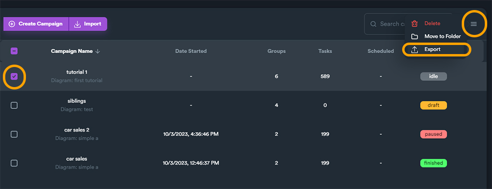
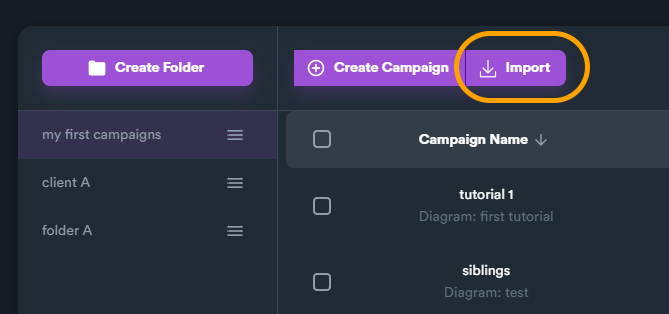
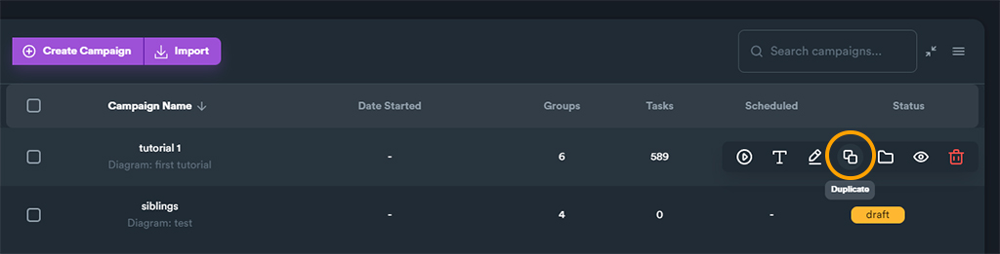

# Campaigns Overview

If you click on "**Campaigns**" from main menu, you will be navigated to **Campaigns Overview** screen.

<figure><figcaption>
You can navigate to Campaigns overview from main menu
</figcaption></figure>

### Creating a New Campaign

To create a new campaign:

* Click on **Campaigns** from main menu
* Click on **Create Campaign** button

<figure><figcaption></figcaption></figure>

A pop-up will appear to give a name on your campaign. Click on **Create** button and you will be navigated to [**Campaign Creation Screen**](campaign-creation-screen/).

### Campaign Information

When you click on a folder you can see all campaigns within the folder along with some basic information for each campaign. Campaign information includes:

**Campaign Name**: the name you give on your campaigns

**Data Started**: date you started the campaign

**Groups**: the number of link groups the campaign includes

**Tasks**: total number of tasks (websites to post)

**Scheduled**: if campaign is scheduled to run on a specific date/time

**Status**: status of the campaign.

<figure><figcaption>
Information columns for all your campaigns
</figcaption></figure>

### Campaign Status

A campaign can be in different status depending on campaign state.&#x20;

Campaign status depicts the state of a campaign. A campaign can be created (**idle**) or can be saved incomplete (<mark style="color:orange;">**draft**</mark>). After the campaign creation, a campaign can be started (<mark style="color:blue;">**started**</mark>), and then either paused (<mark style="color:red;">**paused**</mark>) or run until it's finished (<mark style="color:green;">**finished**</mark>).

<figure><figcaption>
Flow chart of different campaign states
</figcaption></figure>


Keep in mind that an incomplete/**draft** campaign (a campaign with not all required data set) cannot start/run. You will first need to edit the campaign and complete all steps before running it.


On the table below you can find the different campaign statuses/states and what each mean.&#x20;

| Campaign Status                                | Explanation                                                                                                                                                                                                                                                                                                                                                                                 |
| ---------------------------------------------- | ------------------------------------------------------------------------------------------------------------------------------------------------------------------------------------------------------------------------------------------------------------------------------------------------------------------------------------------------------------------------------------------- |
| **idle**                                       | A new campaign that has been created and saved.                                                                                                                                                                                                                                                                                                                                             |
| <mark style="color:orange;">**draft**</mark>   | 
A new campaign that has been saved before completely finishing all steps.

When you create a campaign, there are some creation steps and some required fields. You can exit/save the campaign before completing everything. This created a "<strong>draft</strong>" campaign. A <strong>draft</strong> campaign is incomplete and need to be fully completed before running it.
 |
| <mark style="color:blue;">**started**</mark>   | 
When you start a campaign and while the campaign is running, it is in "<strong>started</strong>" status.

A <strong>started</strong> campaign can be <strong>paused</strong>.
                                                                                                                                                                                                   |
| <mark style="color:red;">**paused**</mark>     | A running campaign be paused and you can continue to run the campaign later.                                                                                                                                                                                                                                                                                                                |
| <mark style="color:green;">**finished**</mark> | When all campaign tasks finish, it becomes "**finished**".                                                                                                                                                                                                                                                                                                                                  |

### Organizing Campaigns Using Folders

Keeping your campaigns inside separate is a good practice. Using folders can help you manage and organize your campaigns based on your websites, clients or projects. For example you can have a folder where you keep all your campaigns for a specific client or website.

To create a new folder click on "**Create Folder**" button located on top left.

<figure><figcaption>
"Create Folder" button located on the top left section - from Campaigns screen
</figcaption></figure>

A new pop-up window will appear to give a name for your folder.

<figure><figcaption>
Give your campaign folder a name and then click "Create" button
</figcaption></figure>

Every time you create a new campaign, the campaign will be saved within the folder that has been selected. In the next image for example, you can see that if you create a new campaign it will saved within the folder "**client A**" which is currently selected.

<figure><figcaption>
Hover buttons appear when you hover (keep move over) a campaign
</figcaption></figure>

You can also move campaigns into other folders. You can either move a single campaign using hover button "**Move to Folder**".

You can also move multiple campaigns into a folder by selecting multiple campaigns and then using  "**Move to Folder**" option from the burger button (on the top-right).

<figure><figcaption></figcaption></figure>

Below is a clip demonstrating how to create a new folder and moves your campaigns inside.

<figure><figcaption>
Clip - demonstrating how to create a folder and move campaigns
</figcaption></figure>

### Import/Export Campaigns

Import/export is a convenient way to transfer selected campaigns into other installations. You can also export your campaigns in case you want to keep a backup of them.

To export: select your campaigns using checkboxes and then use the burger button on the top right. From there you will find an option to export campaigns.

<figure><figcaption>
Export campaign
</figcaption></figure>

To import a campaign: use the "**Import**" button and select any previously exported campaign.

<figure><figcaption>
Import campaign
</figcaption></figure>

### Duplicate Campaign

Many times a user needs to create multiple campaign with minor differences or even create copies of campaigns to use them as basic templates to built a new one.

To duplicate a campaign, use "**Duplicate**" hover button that appears when you hover a campaign from the list.

<figure><figcaption>
Duplicate campaign
</figcaption></figure>

