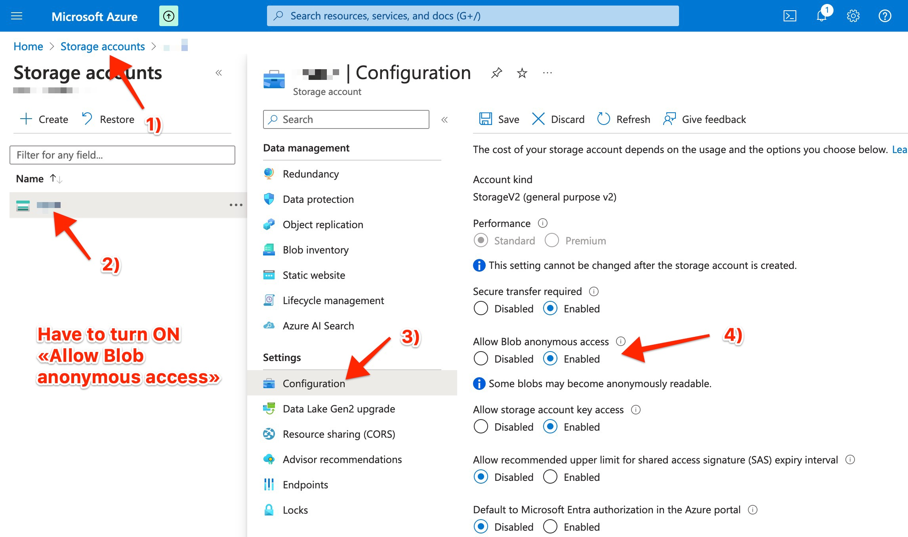

# Azure - setup

### Azure API Settings

Required credentials:

* Connection string

<figure><figcaption></figcaption></figure>

### How to obtain credentials

Login in to your Azure account.

<figure><figcaption></figcaption></figure>

The next step is to create a storage account. Select **Storage accounts** from services (you can also type on search bar "**storage accounts**" to find it)

<figure><figcaption></figcaption></figure>

From **Storage accounts** screen, click on "**Create**", to create a new storage account.

<figure><figcaption></figcaption></figure>

On **Basics** tab, you can set the basic settings for the storage account.

#### Project details:

Select a subscription and a Resource group. You can click on "**Create new**" to create a new resource and give it a name that you prefer. In the example below we used "SEONeo".

#### Instance details:

Give a **Storage account name**, and select region.&#x20;

On Performance, set the first option "**Standard**".&#x20;

On Redundancy select "**Geo-redundant storage (GRS)**" and check the option below "**Make read access to data available in the event of regional unavailability**".

<figure><figcaption></figcaption></figure>

Click next until you finish the setup of your storage account.

To get your credentials, from Home, open your storage (it will have the **Storage account** name you gave on the previous step).

From the menu select "**Access keys**".

From this screen you will find **Connection string** which is what you need for your credentials on SEO Neo.

<figure><figcaption></figcaption></figure>

### **Important : Enabling Allow Blob Anonymous Access**

<figure><figcaption></figcaption></figure>

Also make sure to change the "**Allow Blob Anonymous Access**" setting to "**Enabled**" for your Azure storage account.

