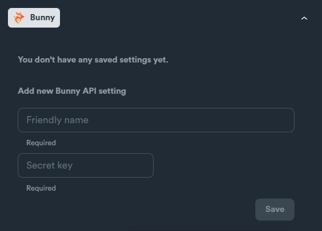

# Bunny - setup

### Bunny API Settings

Required credentials: Bunny requires only an API Key (Secret Key)

<figure><figcaption></figcaption></figure>

### How to obtain credentials

Login in to your Bunny account.

Navigate: **Account** > **Account Settings** to find your Secret Key

<figure><figcaption></figcaption></figure>
