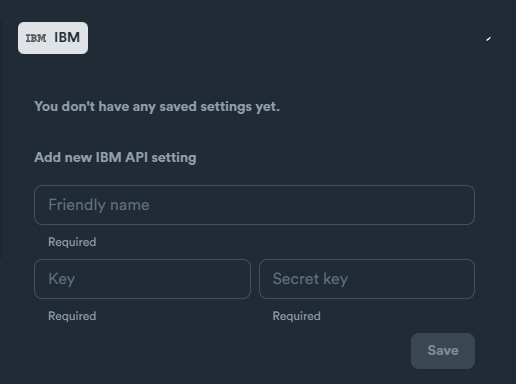

# IBM - setup

### IBM API Settings

Required credentials:

* Key
* Secret key

<figure><figcaption></figcaption></figure>

### How to obtain credentials

Login in to your IBM account.

After you login, navigate to to "**Catalog**".

<figure><figcaption></figcaption></figure>

From Catalog select "**Object Storage**". You can also type "**Object Storage**" on search bar to find it easier.

<figure><figcaption></figcaption></figure>

From Cloud Storage menu, click on "**Service credentials**" tab.

<figure><figcaption></figcaption></figure>

Click "**New Credential**" button.

<figure><figcaption></figcaption></figure>

From the pop-up menu set the options as shown below and click "**Add**" button.

* **Role:** Manager: Manager
* **Select Service ID:** Auto Generated
* **Include HMAC Credential:** Enabled

<figure><figcaption></figcaption></figure>

From the next screen you can find the credentials SEO Neo requires.

| SEO Neo equivalent | IBM                   |
| ------------------ | --------------------- |
| Key                | "access\_key\_id"     |
| Secret key         | "secret\_access\_key" |

<figure><figcaption></figcaption></figure>

