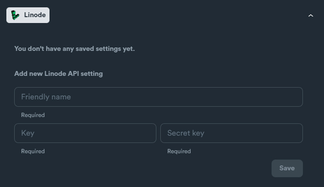

# Linode - setup

### Linode API Settings

Required credentials:

* Key
* Secret Key

<figure><figcaption></figcaption></figure>

### How to obtain credentials

Login in to your Linode account.

Navigate: **Object Storage** > "**Access Keys"** tab > Click **"Create Access Key"** button

<figure><figcaption></figcaption></figure>

Grab your **Key** and **Secret Key**.

<figure><figcaption></figcaption></figure>
