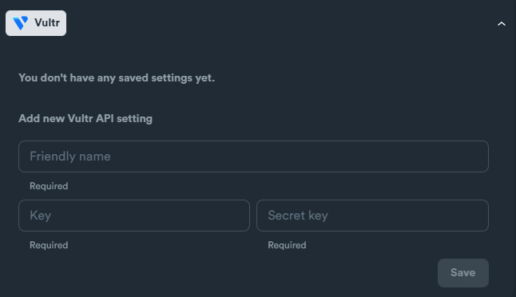

# Vultr - setup

### Vultr API Settings

Required credentials:

* Key
* Secret Key

<figure><figcaption></figcaption></figure>

### How to obtain credentials

Login in to your Vultr account.

Navigate: **Products** > **Objects** > **Add Object Storage**

<figure><figcaption></figcaption></figure>

Select location and label and click "**Add**"

<figure><figcaption></figcaption></figure>

Click on Manage Object Storage to grab your **Key** and **Secret Key**.

<figure><figcaption></figcaption></figure>

**Access Key** is the corresponding **Key** on SEO Neo.
