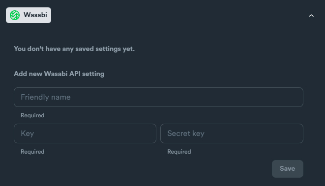

# Wasabi - setup

### Wasabi API Settings

Required credentials:

* Key
* Secret Key

<figure><figcaption></figcaption></figure>

### How to obtain credentials

Login in to your Wasabi account.

Navigate: **Access Keys** > Click **"CREATE NEW ACCESS KEY"** button

<figure><figcaption></figcaption></figure>

Select "**Root User**" and click "**Create**"

<figure><figcaption></figcaption></figure>

Grab your **Key** and **Secret Key**.
