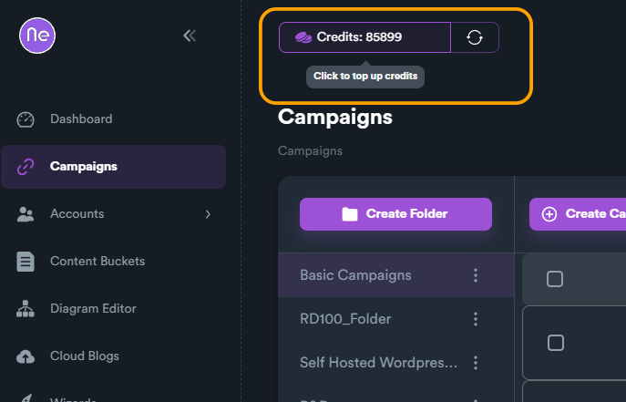

# Credit System

Credits are used to as a pay-on-demand way to use some SEO Neo features that are server and heavy-duty based.&#x20;

### Why the Credit system?

Some new SEO Neo features are heavy-duty and server based. In order not to change the price for all users (even for those that dont want to use a server API-like feature) we have introduced this system. This gives the flexibility to pay for a feature when you want to use it.

### Available Credits

You can view your available credits on the top section of SEO Neo.&#x20;

<figure><figcaption></figcaption></figure>

To refresh your credit balance click on the "refresh" button, located on right.

<figure><figcaption></figcaption></figure>

### How to buy Credits?

You can click on credits balance area to top-up your credits.
