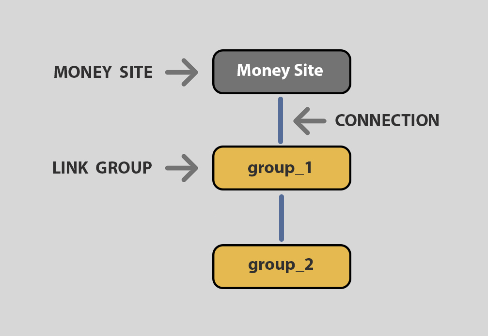
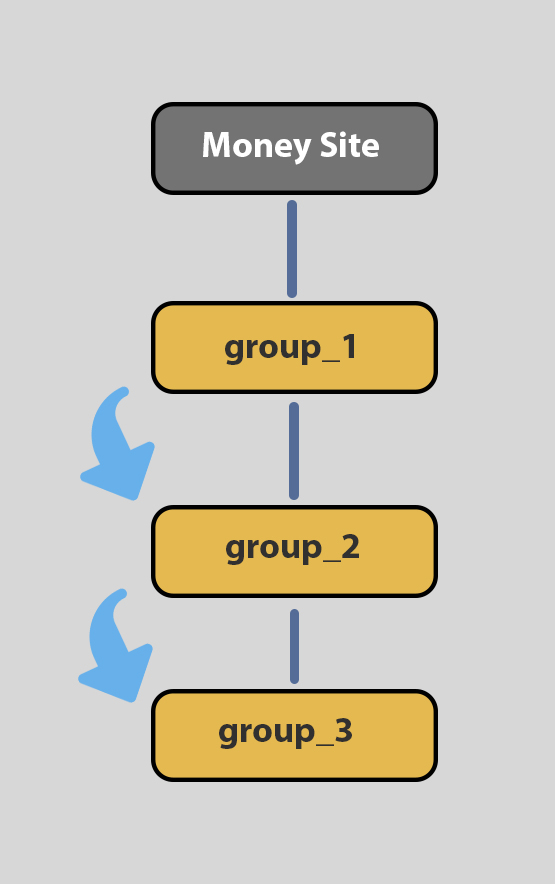

# 🔵 Diagram Editor

### Diagram Editor overview

As the name implies, the diagram editor, is an editor you can use to create your own strategy diagrams. Although SEO NEO comes with a number of preinstalled strategy diagrams included, If you want to [create your own](creating-a-custom-diagram.md) custom diagram you can do it using the diagram Diagram Editor.

<figure><figcaption>
Diagram editor sections overview
</figcaption></figure>

1. **File menu**: Create or select a diagram
2. **Diagram area**: where you create or edit your diagrams
3. **Link group list**:  Drag and drop link group types into diagram to add new groups
4. **Toolbar**: Save, delete diagram. You can also give your diagram a small description.
5. **Navigation toolbar**: You can zoom-in, zoom-out, fit-view or lock diagram.

### What is a diagram ?

A diagram has three basic elements: **money site, link groups** and **connections**.

**Link groups** are groups of tasks that your campaign has. Tasks are separated by groups in order to differentiate types of sites.

**Connections** are lines within a diagram that connect link groups with money site or with other link groups.

**Money site** is the list of URLs your campaign is targeting.

<figure><figcaption>
Different parts of a diagram
</figcaption></figure>

When you **connect a link group with your money site**, this means that your money site URLs will take backlinks from these groups.

When you **connect a link group with another link group**, you create a flow between these groups. This means that after the first link group finishes, it gives all submitted URLs (created from posts etc.) to the other link group.

<figure><figcaption>
Flow between link groups. When group<em>1 finishes, it gives its submitted URLs on group</em>2. Then group<em>2 gives links to group</em>_3
</figcaption></figure>

Creating a "_more complex_" makes your campaign seem more "natural". Its better for your link profile to have more than 1 tiers.
