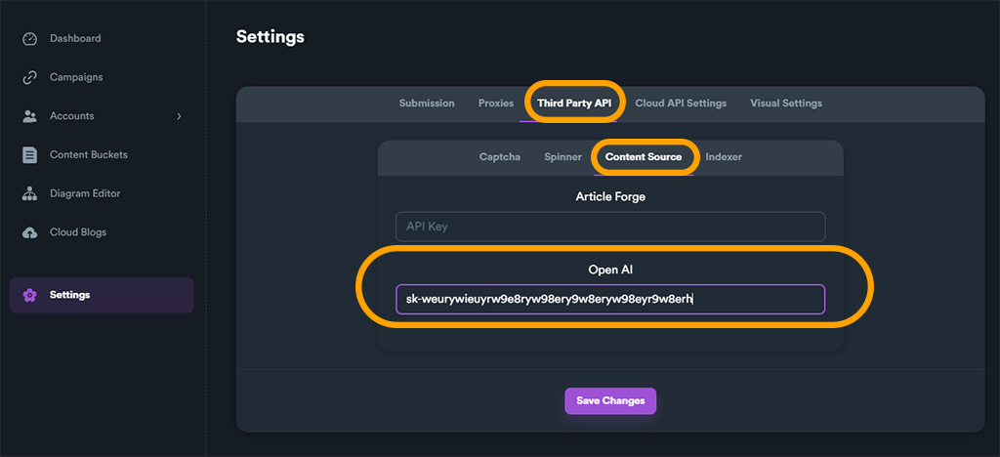

# OpenAI for Content Buckets

Search engines prioritizes high quality original content. That's why using high-quality content is key from an SEO perspective.&#x20;

Although SEO Neo comes with [**a free built-in article builder**](article-builder.md), using the power of AI is the way-to-go to create high quality and niche-relevant articles for your campaigns. And when we are talking about AI, one thing comes in everyone's mind... **OpenAI** !


Using **high quality articles** can dramatically boost ranking results of your campaigns.


SEO Neo has integration with OpenAI that allows you to generate extremely powerful articles for your campaigns. In order to use OpenAI you first  will need to generate an API key.

### Generating OpenAI secret key (API Key)

Navigate to OpenAI website and click on "API" section.

<figure><figcaption></figcaption></figure>

Open account menu. You can find it on the top-right section and click on "**View API Keys**".

<figure><figcaption></figcaption></figure>

<figure><figcaption></figcaption></figure>

From the next screen, click on "**Create new secret key**" button.

<figure><figcaption></figcaption></figure>

A new pop-up will appear. Give your key a **Name** and click on "**Create secret key**" button.

<figure><figcaption></figcaption></figure>

Your secret key will be generated. Copy your **secret key** (because you will need it to setup OpenAI on SEO Neo) and click "**Done**".

<figure><figcaption></figcaption></figure>

### Setting OpenAI secret key (API key) on SEO Neo

To set your API key, from SEO Neo navigate:

**Settings > Third Party API > Content Source**

Paste your OpenAI generated **secret key** that you copied earlier on "**OpenAI**" field.

<figure><figcaption></figcaption></figure>


Don't forget to save your settings by clicking "**Save Changes**" button.&#x20;


Now you are ready to use OpenAI for your content on content buckets.

<figure><figcaption></figcaption></figure>

Watch our [**Tips and Tricks video**](https://youtu.be/cVdeYw-PIuk) on how to use OpenAI for your content buckets below:


