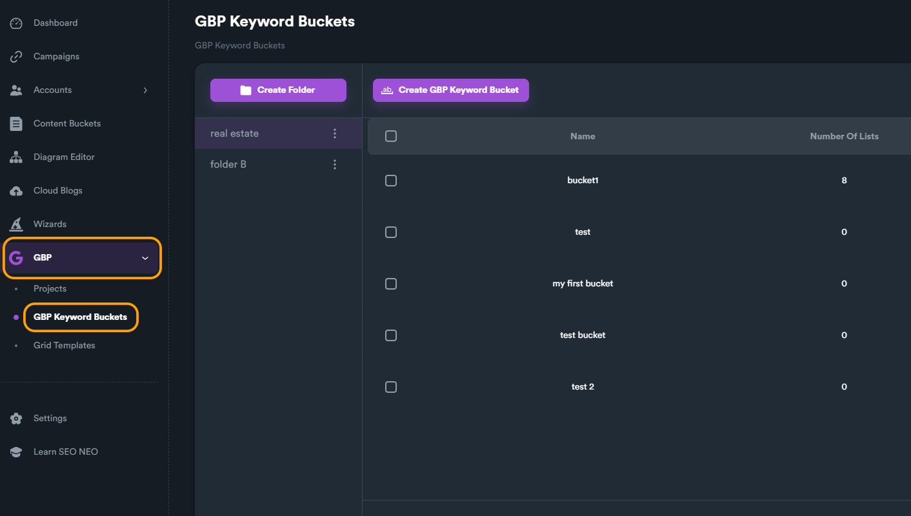

# GBP Keyword Buckets

### Keyword Buckets & Keyword Lists

Keyword buckets are similar to other buckets found in SEO Neo, but instead of containing accounts or content, they include **keyword lists**. Each keyword list is a collection of keywords. Keyword lists and keyword buckets are used in GBP to generate heatmaps or create campaigns using Wizards (applicable to GBP wizards).

### Why Buckets and Lists?

**Keyword buckets** are simply containers that can include different **keyword lists**. These buckets simplify the management of various keyword lists. You can create different folders, with each folder containing distinct buckets, and each bucket can hold different lists. This organization makes it easier for users to manage and categorize their keywords based on project, client, niche, or even geographical area.

To better understand the structure, refer to the image below that showcases the tiers and structure.

<figure><figcaption></figcaption></figure>


Although this scheme of buckets and lists may seem confusing at first, it offers great flexibility when it comes to managing keywords for your GBP projects.


### Creating GBP Keyword Buckets

To create a new GBP keyword bucket, click on "GBP keyword Buckets" from the main modules menu.

<figure><figcaption></figcaption></figure>

From this menu you can see and manage all your GBP keyword buckets. To create a new bucket, click on "**Create GBP Keyword Bucket**" button and give a name for your bucket.

<figure><figcaption></figcaption></figure>

<figure><figcaption></figcaption></figure>

After clicking giving a name and clicking "Create" button, you will be automatically navigated within the created and empty keyword bucket.&#x20;

This is where you can create your keyword lists.

### Creating Keyword Lists

To create your keyword list, click on "**Create Keyword List**" button.

<figure><figcaption></figcaption></figure>

A new pop-up window will appear where you can give a name for your list and enter all your keywords. To save your list, click on "**Save**" button.

<figure><figcaption></figcaption></figure>

After saving your keyword list, you can view and manage your lists using hover buttons (hover a keyword list to see hover buttons).

To view and edit keywords within a list, click on "**Edit keywords**" hover button.

<figure><figcaption></figcaption></figure>

The same applies for your keyword buckets. To view keyword lists within each bucket, use "**View Lists**" hover button to open the bucket and view all keyword lists inside.

<figure><figcaption></figcaption></figure>

You can also multiple select your keyword lists or even your keyword buckets to delete them.

<figure><figcaption></figcaption></figure>


GBP Keyword Buckets system is a flexible way to organize your GBP keywords. Use keyword buckets and keyword lists to organize your keywords the way it fits your needs. For example, you could use different buckets for different clients and then use keyword lists for niches, or product types.


