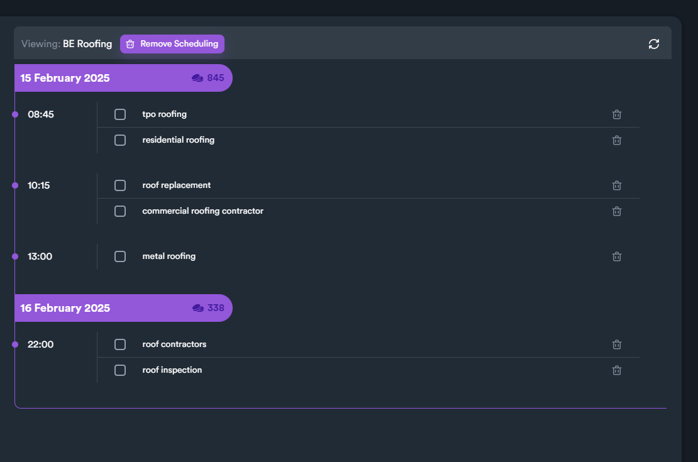
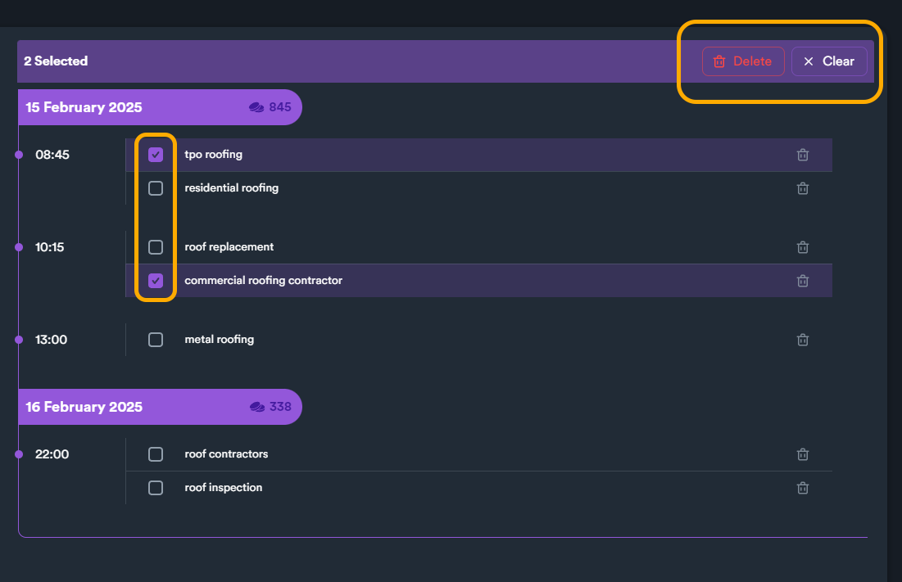
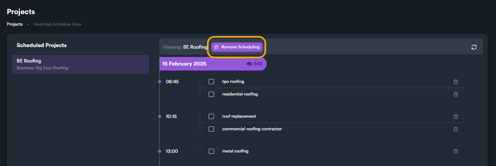

# Heatmap Scheduling - View

Scheduling View lets you see all your scheduled heatmaps, and even remove scheduling from them in  a single and convenient view.

To access scheduling view, from GBP Projects, click on the "calendar" button.

<figure><figcaption></figcaption></figure>

A new view will open, where you can see all your schedules. To view scheduled heatmaps, click on the left section to navigate between different projects.


SEO Neo will only show projects on the list that have at least one scheduled heatmap.


<figure><figcaption></figcaption></figure>

After selecting the project, you will see all scheduled heatmaps on the right side.&#x20;

<figure><figcaption></figcaption></figure>

On the right side SEO Neo will display all scheduled heatmaps within the project separated by days. and time.

<figure><figcaption>
Schedule Example 1
</figcaption></figure>

<figure><figcaption>
Schedule Example 2
</figcaption></figure>

On each day group, you can also see how many credits will be consumed for all heatmaps (for the entire day).

<figure><figcaption>
Credits shown for each scheduled day
</figcaption></figure>

**Repeated schedules** will be shows with a recurring arrow icon to distinguish them from **single schedules**.

<figure><figcaption></figcaption></figure>

***

### Deleting Schedules

To delete individual heatmap schedules, you can use the "bin" icon on the right side of each heatmap.

<figure><figcaption></figcaption></figure>

You can also use multiple selection (using the checkbox and the action button) to delete scheduling from selected heatmaps.

<figure><figcaption></figcaption></figure>


Deleting a schedule from a heatmap or a project **WILL NOT** delete the heatmap or the project itself - just the scheduling from the heatmap/project.


To remove all scheduled heatmaps from a an entire project, you can use the "**Remove Scheduling**" button.

<figure><figcaption></figcaption></figure>

When you try to delete a repeated-type schedule, SEO Neo will throw a message and ask you how you want to be handle the delete process. You can choose to delete only current dates (which will break the repeated process) or delete the entire repeat chain (which will remove the entire schedule from selected heatmap).

<figure><figcaption></figcaption></figure>
