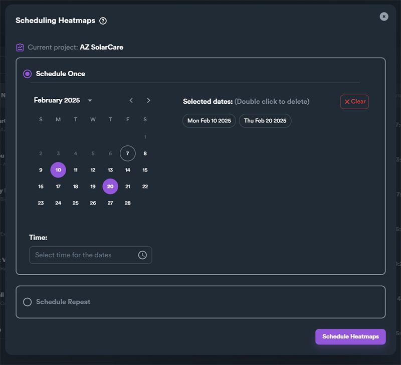
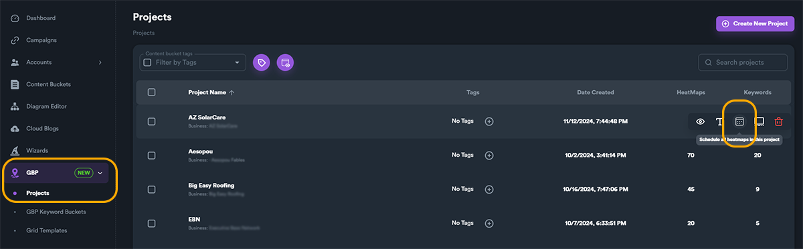
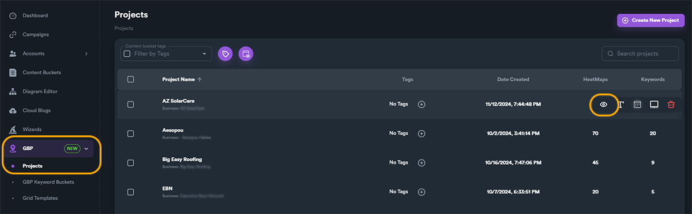
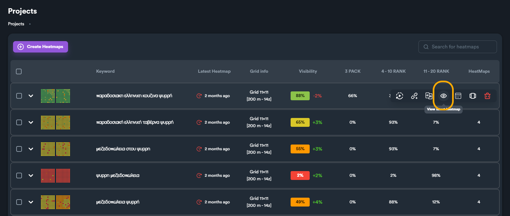
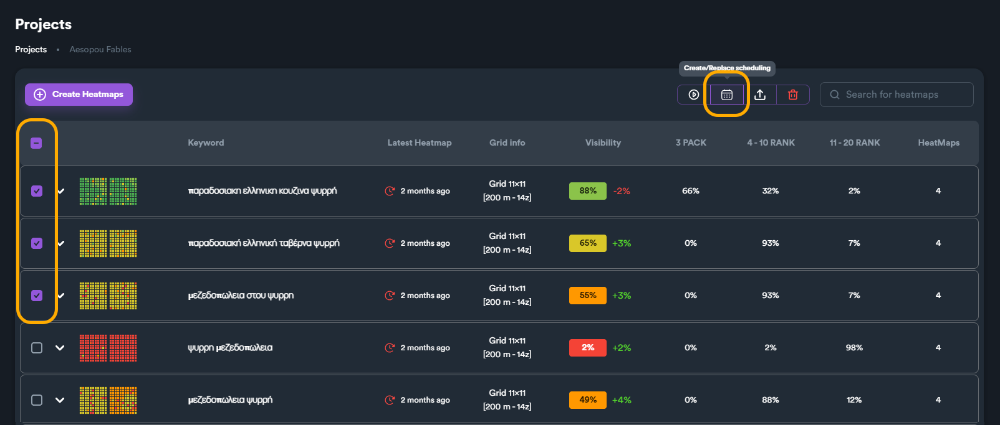

# Heatmap Scheduling

### What is Heatmap Scheduling

Heatmap scheduling allows you to plan and automate your heatmap checks in advance. This feature is especially useful when you need to schedule heatmaps ahead of time, set them up while you're not actively using SEO Neo, or align them with the business hours of specific [**GBP (Google Business Profile)**](./) locations.

You can schedule individual heatmaps run checks or entire heatmap projects. The last one will schedule all keyword heatmaps of selected project.

<figure><figcaption></figcaption></figure>

***

### Access Heatmap Scheduling Window

To schedule an entire project, from main modules menu navigate:

* **GBP** > **Projects** > "**Schedule all heatmaps**" hover **button**.

<figure><figcaption></figcaption></figure>

To schedule individual heatmaps navigate:

* **GBP** > **Project** > click on "**View heatmaps**" to open a project.

<figure><figcaption></figcaption></figure>

From project view, you can either use hover button "**schedule heatmap**" to open schedule menu for selected keyword heatmap.

<figure><figcaption></figcaption></figure>

You can also select and schedule multiple keyword heatmaps, using the checkbox to select multiple heatmaps and then use "**Create/Replace Scheduling**" action **button**.

<figure><figcaption></figcaption></figure>

***

### Types of Scheduling

There are two types of heatmap scheduling:

* Schedule Once
* Schedule Repeat

With schedule once you set date(s) and a common time using a calendar to schedule future heatmap checks. You can set single or multiple dates for scheduling.

<figure><figcaption></figcaption></figure>


If you use schedule once option, once SEO Neo runs the heatmap on selected date, heatmap will not run again in the future. If you want to run recurring heatmap checks, use **Schedule Repeat** option.


With schedule repeat, you schedule heatmap checks, based on days of weeks or month that are recurring. This means that if for example you set a repeat check for Monday, the heatmap check will run on every Monday, every week.

<figure><figcaption></figcaption></figure>

***

### Schedule Once

With this options you can set a number of different days that you want to schedule your heatmap checks in advance.

You can select multiple dates from the calendar widget.

<figure><figcaption></figcaption></figure>

Then select a time from below (selected time will be common for all dates selected).

<figure><figcaption></figcaption></figure>

You can view all selected dates on the right side of the window. You can also remove any date from the right side by double-clicking on any date.

<figure><figcaption></figcaption></figure>

To remove all scheduled dates, click on "Clear" button on the top right section.

<figure><figcaption></figcaption></figure>

When you finish, click on "**Schedule Heatmaps**" button.

***

### Schedule Repeat

Schedule repeat allows you to schedule days of the week or days of the month that will be repeated again after they run. SEO Neo will repeat these schedule runs indefinitely every week or every month until they get deleted. We will see how we can edit or remove a schedule later on.

Schedule repeat has two sub-options:

* Schedule by days of week: you select which days of the week heatmap checks will run.
* Schedule days of months: you select dates for every month.

To select days of week, select the first option, and click the days (circles). In the example below, we have selected to run heatmap checks every **Monday** and **Friday**.

<figure><figcaption></figcaption></figure>

To select days of month, use the second option. From there you can select different days of the month from the calendar widget.

<figure><figcaption></figcaption></figure>

Because months have different number of days, there are also day modifiers. these let you select last days of a month automatically without having to worry about the number of days each month has. By enabling these options you can set SEO Neo to run your checks on last day of the month, or one, or even two days before the last day of the month.

<figure><figcaption></figcaption></figure>

In the example above, we have selected to run checks every 1st and 15th on every month, but also on the last day of the month. This means that a month like February which has 28 days, will also run check on the 28th day. On a month like January will run check on 31st.

***

### Scheduled Heatmaps

Scheduled heatmaps or scheduled projects (all included heatmaps) will be indicated with an icon.

<figure><figcaption></figcaption></figure>

***

