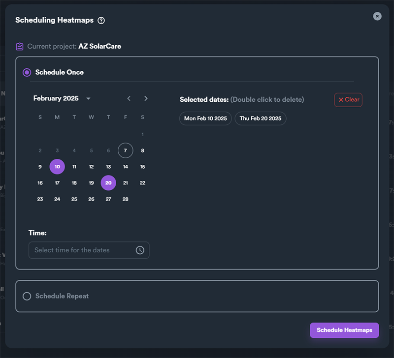
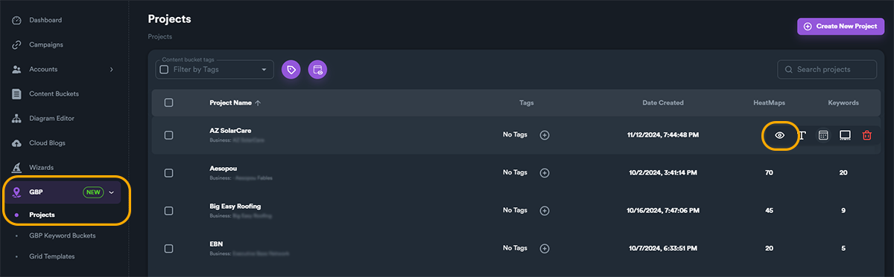
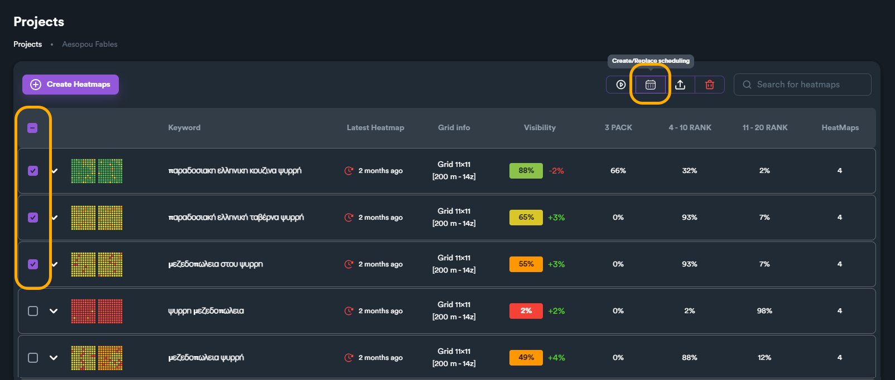

# Heatmap Scheduling

### What is Heatmap Scheduling

Heatmap scheduling allows you to plan and automate your heatmap checks in advance. This feature is especially useful when you need to schedule heatmaps ahead of time, set them up while you're not actively using SEO Neo, or align them with the business hours of specific [**GBP (Google Business Profile)**](../) locations.

You can schedule individual heatmaps run checks or entire heatmap projects. The last one will schedule all keyword heatmaps of selected project.

<figure><figcaption></figcaption></figure>

***

### Access Heatmap Scheduling Window

To schedule an entire project, from main modules menu navigate:

* **GBP** > **Projects** > "**Schedule all heatmaps**" hover **button**.

<figure><figcaption></figcaption></figure>

To schedule individual heatmaps navigate:

* **GBP** > **Project** > click on "**View heatmaps**" to open a project.

<figure><figcaption></figcaption></figure>

From project view, you can either use hover button "**schedule heatmap**" to open schedule menu for selected keyword heatmap.

<figure><figcaption></figcaption></figure>

You can also select and schedule multiple keyword heatmaps, using the checkbox to select multiple heatmaps and then use "**Create/Replace Scheduling**" action **button**.

<figure><figcaption></figcaption></figure>

***

### Types of Scheduling

There are two types of heatmap scheduling:

* Schedule Once
* Schedule Repeat

With schedule once you set date(s) and a common time using a calendar to schedule future heatmap checks. You can set single or multiple dates for scheduling.

<figure><figcaption></figcaption></figure>


If you use schedule once option, once SEO Neo runs the heatmap on selected date, heatmap will not run again in the future. If you want to run recurring heatmap checks, use **Schedule Repeat** option.


With schedule repeat, you schedule heatmap checks, based on days of weeks or month that are recurring. This means that if for example you set a repeat check for Monday, the heatmap check will run on every Monday, every week.

<figure><figcaption></figcaption></figure>

***

###

