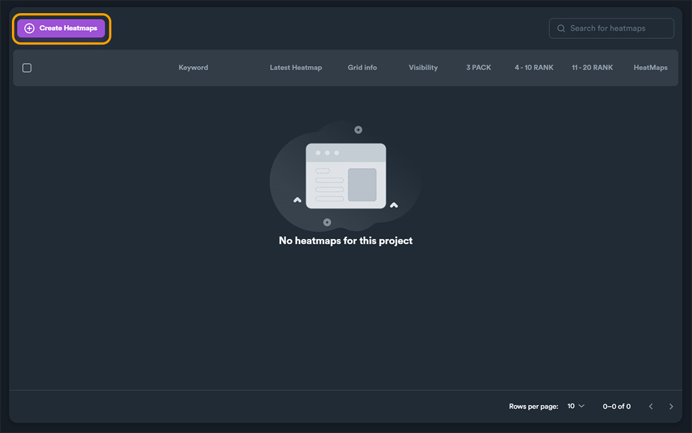
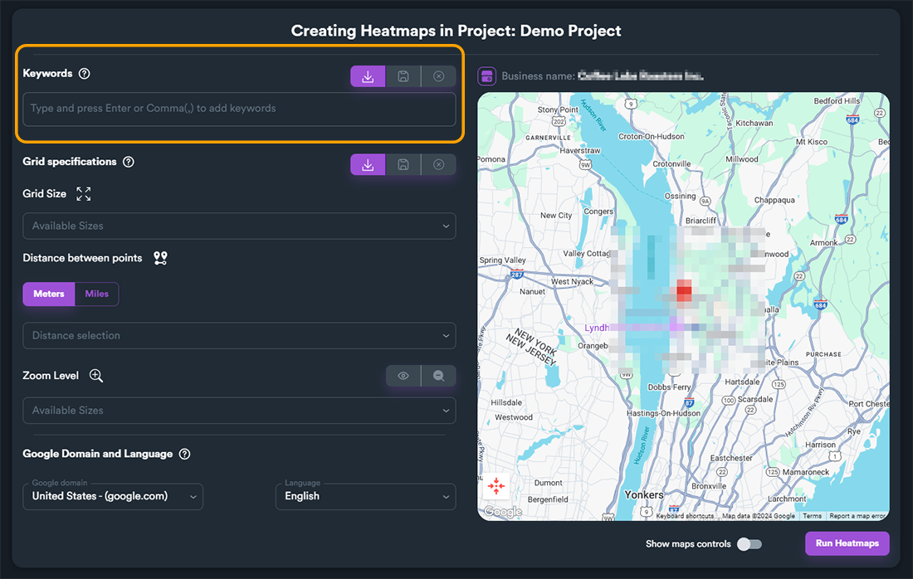
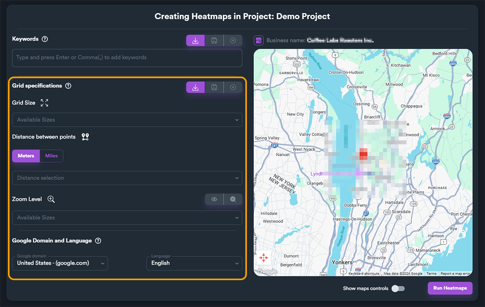
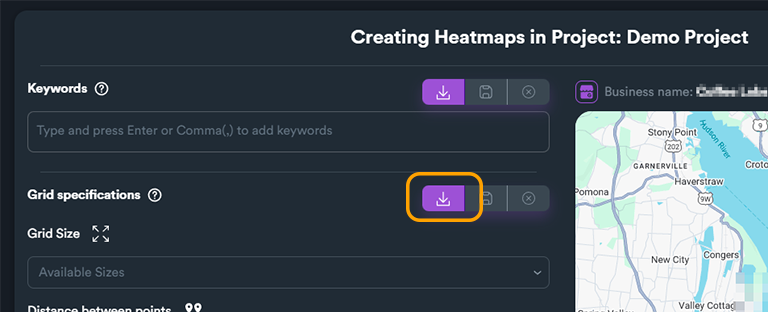
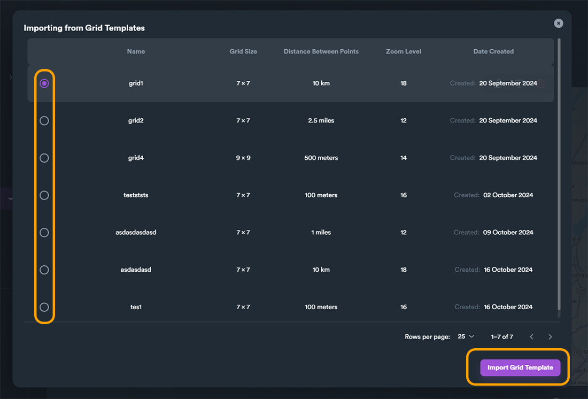
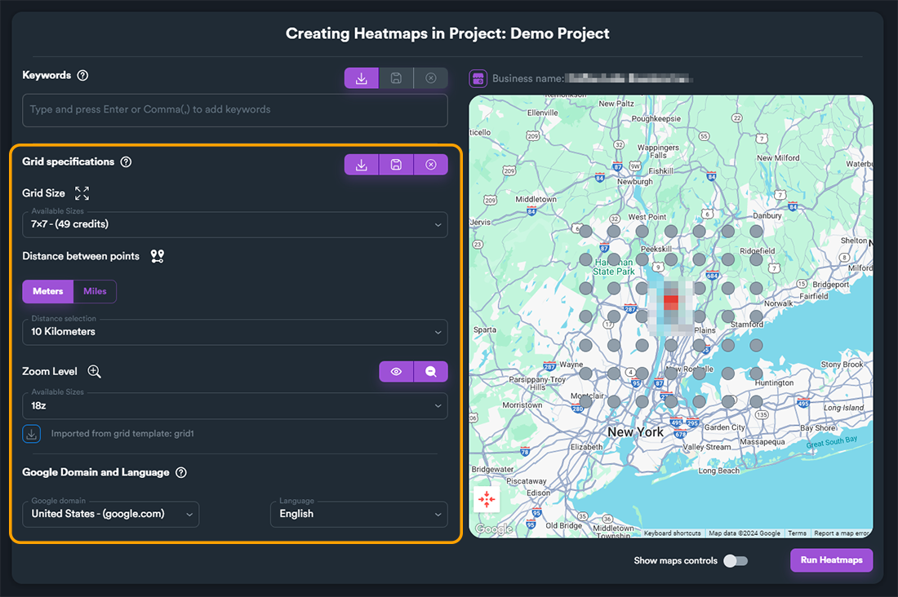

# Heatmaps

### Creating a new Heatmap

After creating a new project, the project will be empty and it will not have any heatmaps.

<figure><figcaption></figcaption></figure>

To create a new heatmap got your project, click on "**Create Heatmaps**" button.

<figure><figcaption></figcaption></figure>

When you create a heatmap, a new window view will open. This view has two different sections. The first section is about **keywords** and the second one is about the **grid settings**.

<figure><figcaption>
Create heatmap - keywords section
</figcaption></figure>

<figure><figcaption>
Create heatmap - grid settings section
</figcaption></figure>

### Grid Specifications

If you have created grid templates, you can use "**Import grid template**" button to import your grid specification settings.

<figure><figcaption></figcaption></figure>


Using grid templates can save you time, as you can create and save different grid template settings that can be used in your projects. Click [**here to read more**](grid-templates.md) about grid templates.


In our example will will load a previously-created grid template. When you click on "**Import grid template**" a pop-up window will open with all grid templates. Select the desired grid template and click on "**Import Grid Template**" button to fetch grid settings.

<figure><figcaption>
Import grid template window
</figcaption></figure>

All grid settings from the template will be loaded.

<figure><figcaption></figcaption></figure>

### Keywords

fgfghfgh
