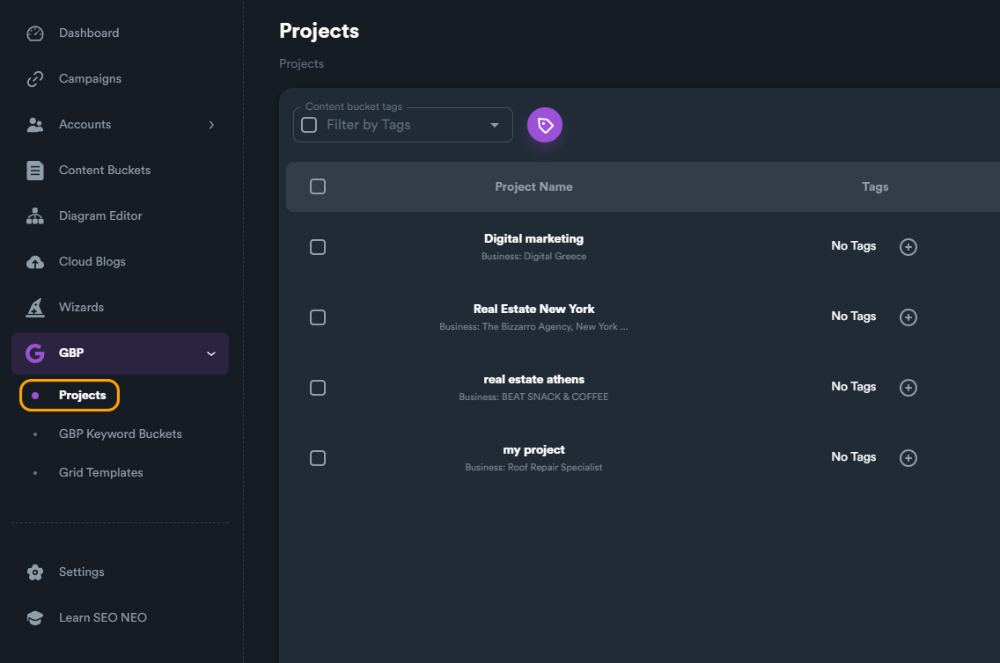
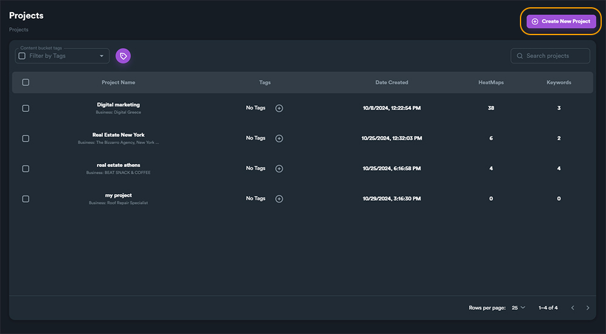
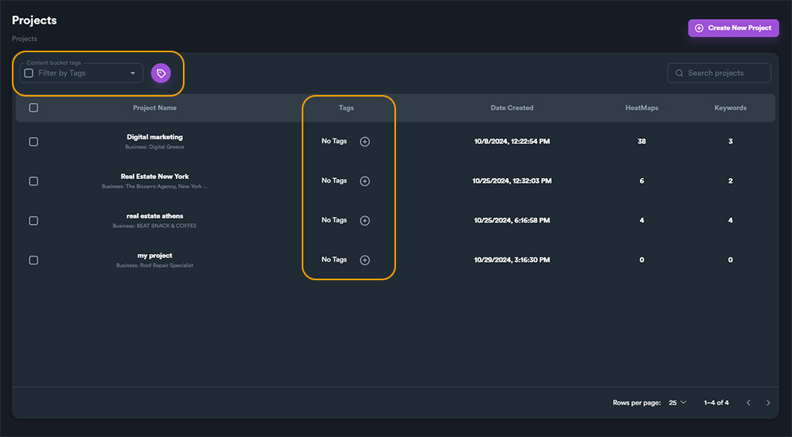
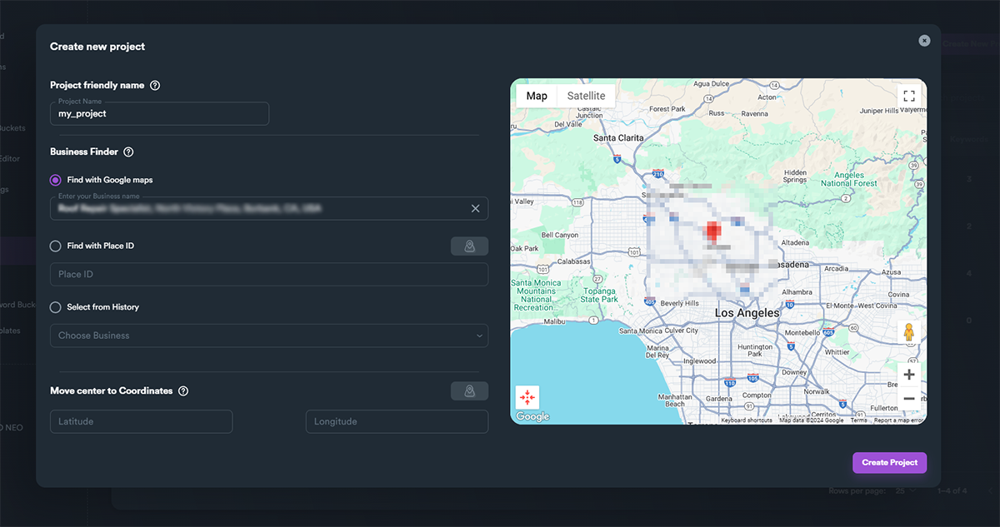
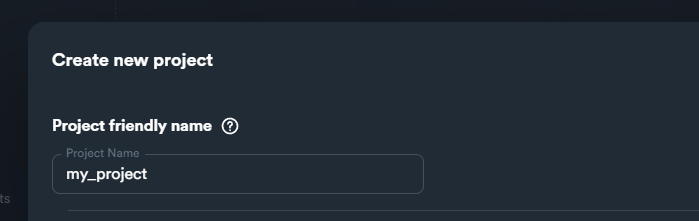
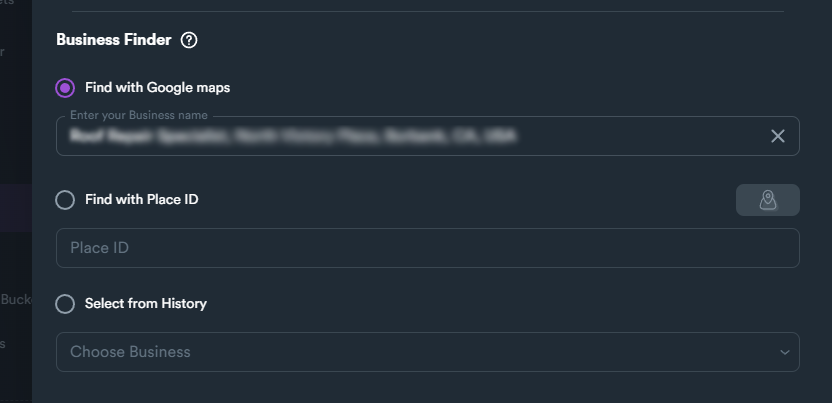
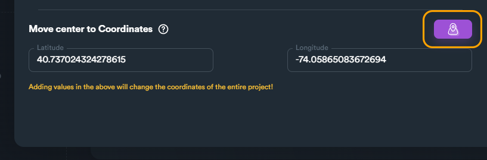

# Projects

### Creating a new GBP Project

To create a new GBP project, first navigate to **GBP > Projects** from main modules menu and then follow the same method you use to create a new campaign.&#x20;

<figure><figcaption></figcaption></figure>

To create a new project, click on "**Create New Project**" button.

<figure><figcaption></figcaption></figure>


You can also use **Tags** to organize your GBP projects (as with **Content Bucket Tags**). For more information on tags, [**read this section**](../content-buckets/content-bucket-tags.md) of the documentation.



After clicking "**Create New Project**" button a new window will load where you can enter all your project details.

<figure><figcaption>
New GBP project window
</figcaption></figure>

###

### New Project Details

On **Project friendly name** you give your project a name.

<figure><figcaption></figcaption></figure>

### Business Finder

This is how you can enter your GBP business profile. There are three different ways to locate/enter your business on your project.

<figure><figcaption></figcaption></figure>

* **Find with Google maps:**\
  This is the easiest and fastest way to find/locate your business. Write down your business name (as in Google maps) and select it from the auto-suggest list.&#x20;
* **Find with Place ID:**\
  You can use your place ID (within your Google business profile).
* **Select from History:**\
  If you have already created a previous project for your business with SEO Neo, you can select this option and find it from the list.

### Move center

You can move center by entering coordinates (latitude and longitude coordinates). To preview your coordinates on preview map, click on the button on the right side.

<figure><figcaption></figcaption></figure>

You can create only one project for each business profile. Within each project you can have different keywords and different heatmaps. This way SEO Neo can track your business rankings on different keywords and generate detailed analytics for your business.

If you try to create another project for an existing business profile, you will get the following error message:

<figure><figcaption></figcaption></figure>

In case you really need to create multiple projects for the same business profile, you can use **Move center.** Move center is useful when you want to create a project for a business that already exists on another project.&#x20;


For **multiple projects** for the **same business profile**, use Move center to Coordinates.


When you finish with your project details, click on "**Create project**" button. This will create a new and empty project for you. Within each project you can create different heatmaps to track your business.

On the next section we will see how we can create heatmaps.
