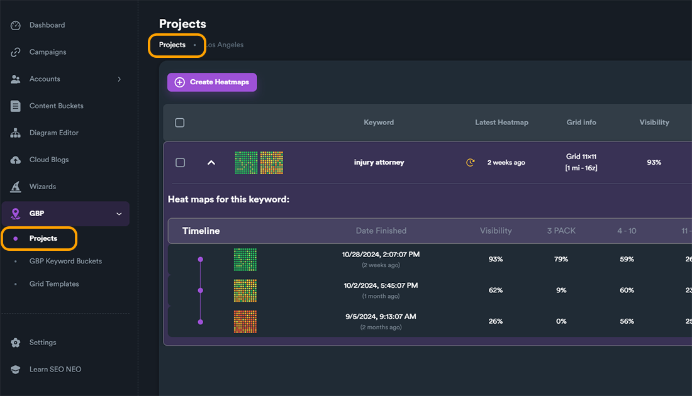
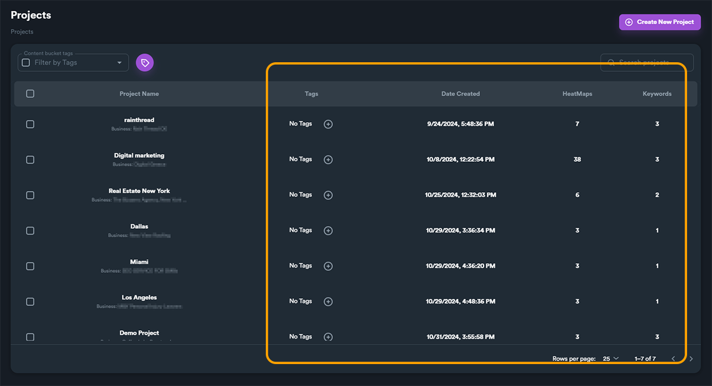
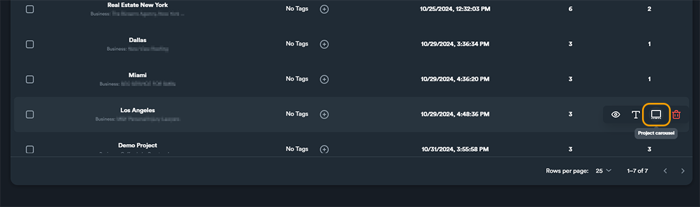
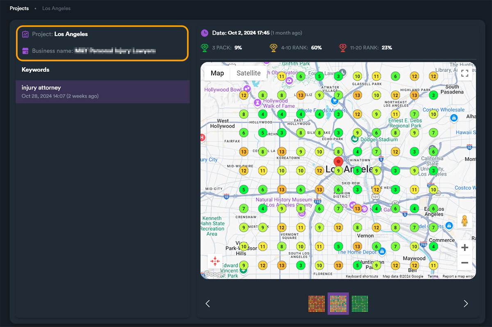
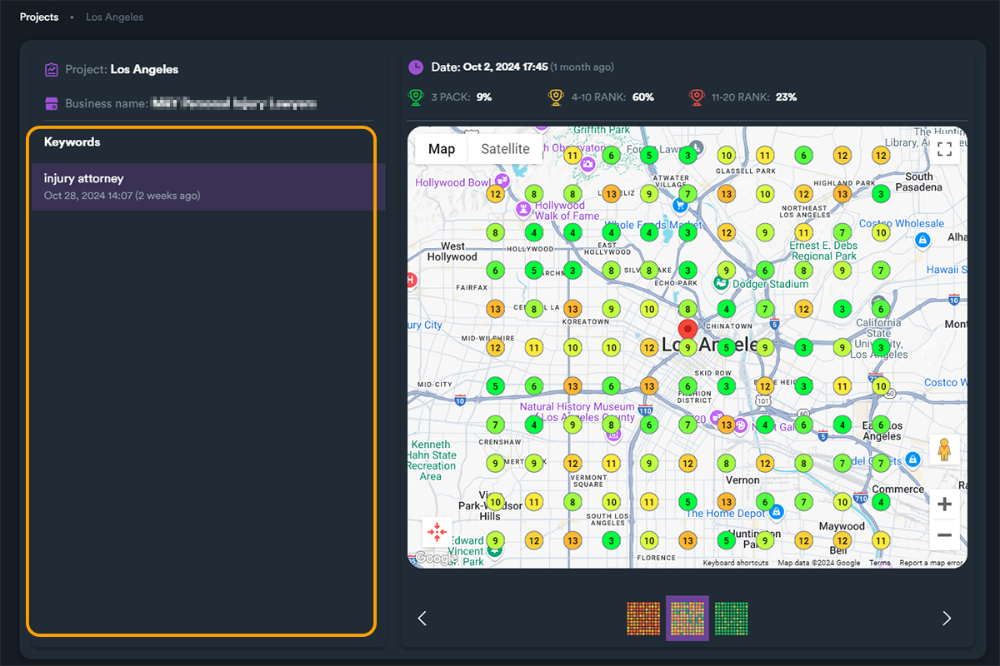
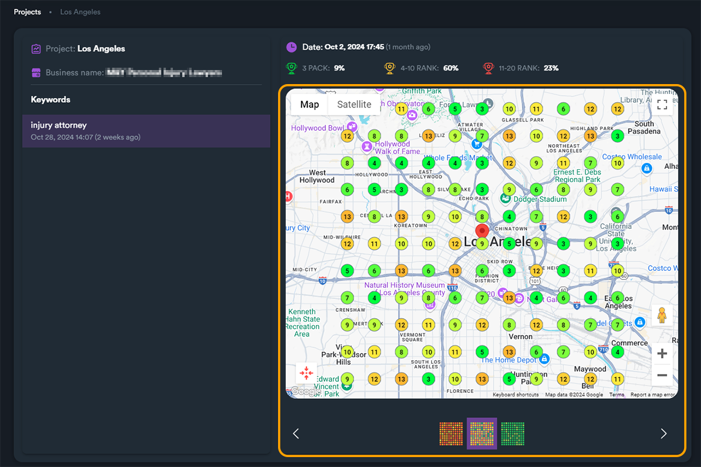
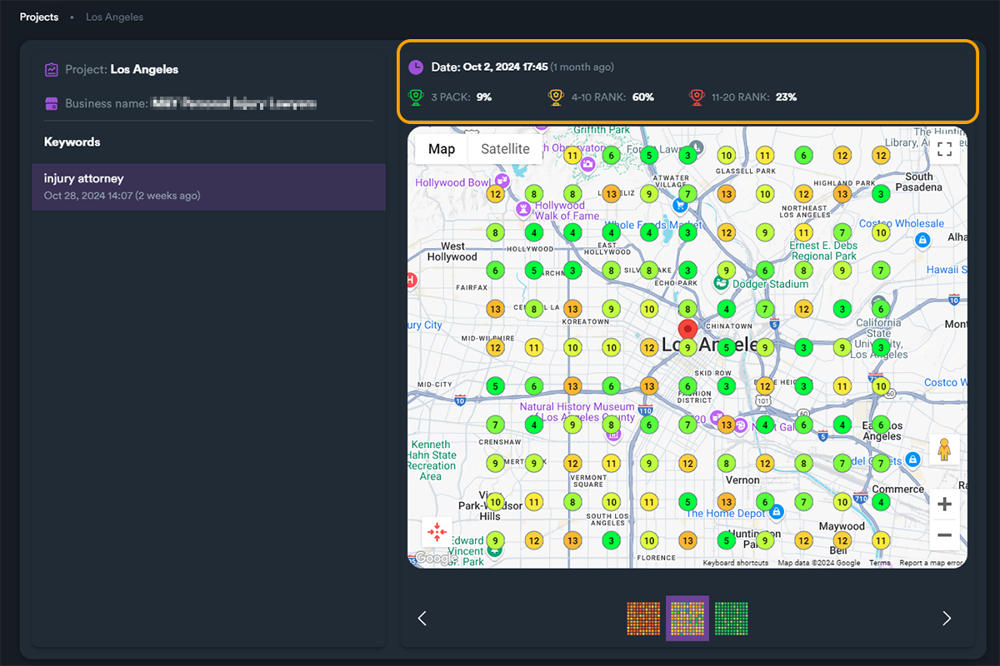
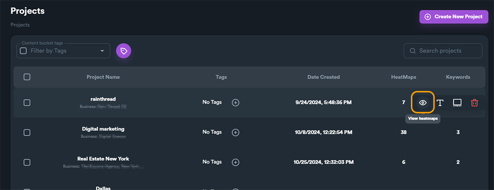

# Projects: Basic Results

Now that have created your heatmap for a project we will cover how you can view different details and metrics for your heatmaps.

For an overview of your project results, you can navigate back to projects section. You can either click on "**Projects**" from main module menu, or on the breadcrumb button on the top section.

<figure><figcaption>
Navigating back to Projects section
</figcaption></figure>

From here you can view all your projects with some basic information for each project. In our example here we have created several projects with different heatmaps for each project.


If you are a new user you may have a different view, but after creating some projects and running several heatmaps you will get similar views and options.


<figure><figcaption>
Projects information
</figcaption></figure>

In projects view you can also use an overview of your project heatmaps and keywords using the **Project Carousel**. Click on "**Project Carousel**" hover button (while hovering on a project).

<figure><figcaption>
Project Carousel hover button
</figcaption></figure>

### Project Carousel

Project Carousel shows you all heatmaps and metrics for all keywords of the project in one view. On the top left section you can see the **Project** name and the **Business name**.

<figure><figcaption></figcaption></figure>

On the left there is a list with all project's keywords. In the following example there is only one keyword "injury attorney". Clicking on the keyword will load all heatmaps.

<figure><figcaption></figcaption></figure>

To view different heatmaps for select keyword click on heatmap thumbnails (located under heatmap)

<figure><figcaption></figcaption></figure>

Clicking on any heatmap will load basic information and metrics including its creation **dat**e, **3 PACK**, **4-10 RANK** and **11-20 RANK**.

<figure><figcaption></figcaption></figure>

**Project Carousel** is a very useful feature that allows you to get an overview for all heatmaps for all keywords within a project.

For more details regarding each keyword and it's heatmap click on "**View Heatmaps**" hover button button, while hovering on a project.

<figure><figcaption></figcaption></figure>

From there we can get detailed results, metrics, comparison tables and export results in .pdf files. For more information [**read the next section**](projects-heatmap-results.md).
