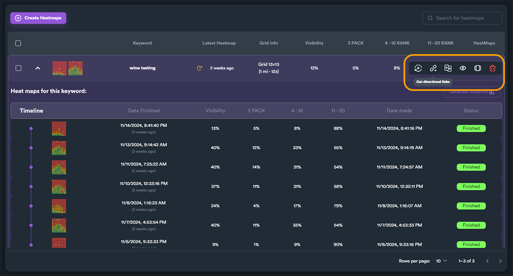
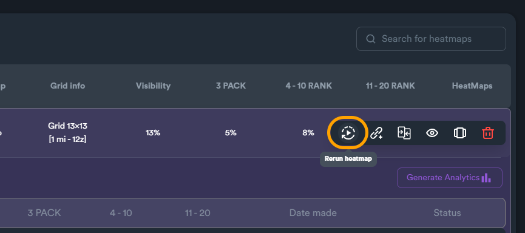
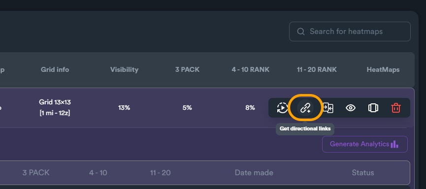
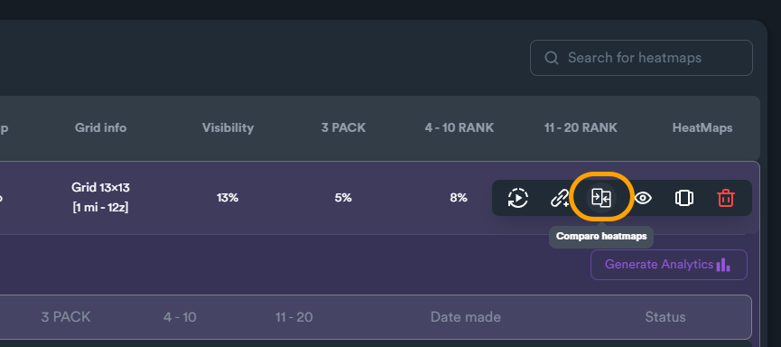
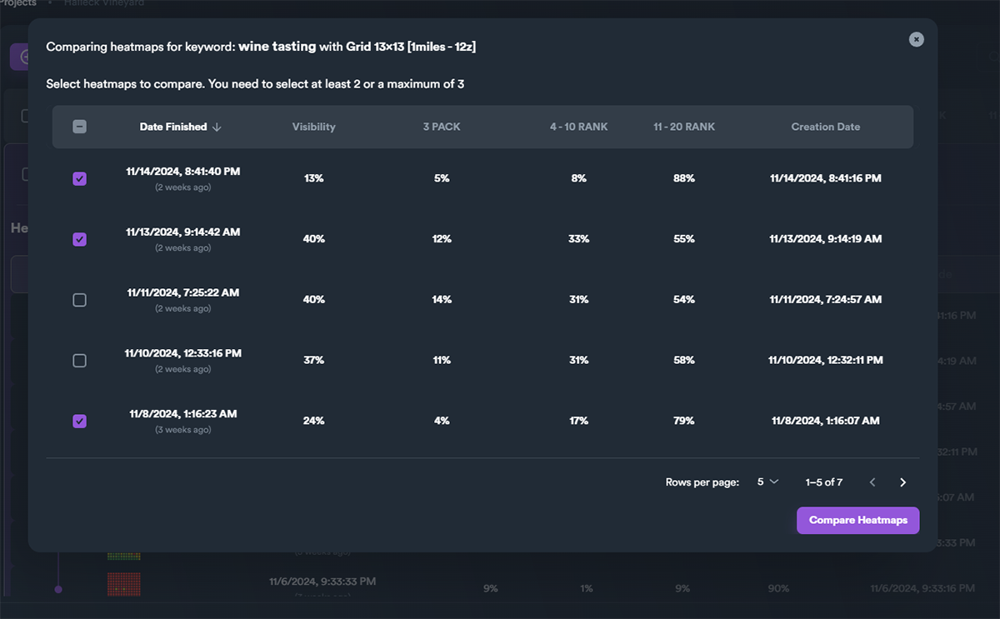
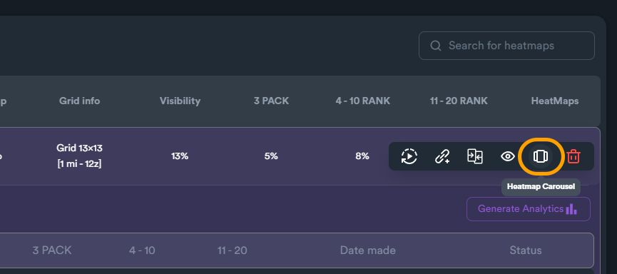
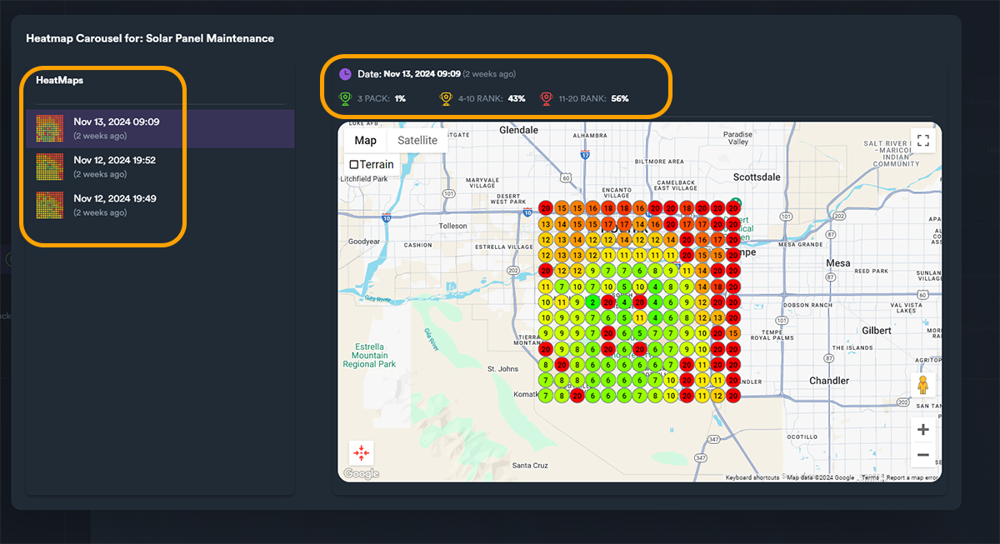

# Projects: Heatmap Controls

Heatmap Projects have a number of different tools and functions that can be accessed through hover buttons (by hovering a project on the project list).

<figure><figcaption>
Heatmap projects - hover buttons
</figcaption></figure>

## Hover Tools / Functions

#### Rerun heatmap

Creates (runs) a new heatmap for current keyword

<figure><figcaption></figcaption></figure>

#### Get directional links

This is a powerful SEO Neo feature that gives you access to fetched directional links and copies them to clipboard.

<figure><figcaption></figcaption></figure>

#### Compare heatmaps

This feature allows you to compare different heatmaps (same keyword, different time generated).

<figure><figcaption></figcaption></figure>

When you click on "**compare heatmaps**" a new window opens that allows you to select up to three heatmaps. After selecting the heatmaps, click on "**Compare Heatmaps**" button to proceed.

<figure><figcaption></figcaption></figure>

A new window appears showing a comparison table. This table includes (up to three) colums with metrics and graphs for each heatmap. Using this feature you can easily find out your heatmap ranking progress in a single and simple view.

<figure><figcaption></figcaption></figure>

#### View Latest Heatmap

This will open a detailed heatmap view of the last generated (by date) heatmap.

<figure><figcaption></figcaption></figure>

#### Heatmap Carousel

This feature allows you to have all your heatmaps (within the project) in a single (carousel) view.

<figure><figcaption></figcaption></figure>

You can change between different heatmaps by clicking on the them on the heatmaps list on the left section. When you click on any heatmap you will see different metrics for selected heatmap and of course the heatmap itself.

<figure><figcaption></figcaption></figure>

