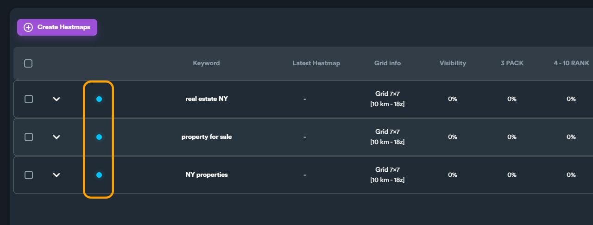
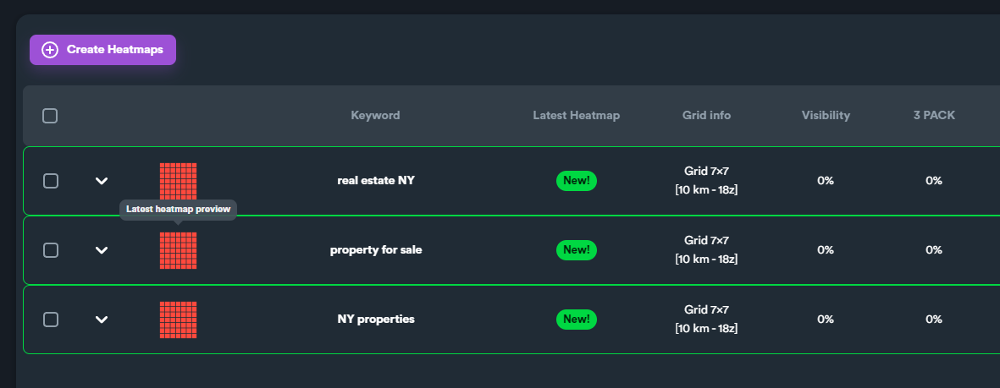
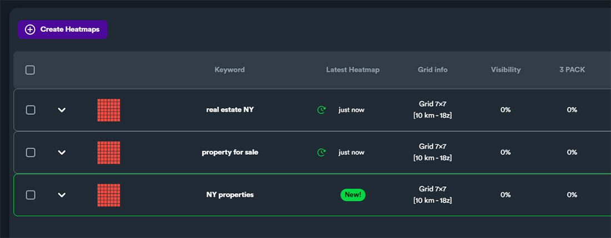
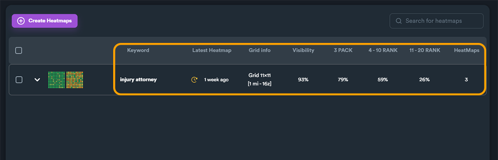
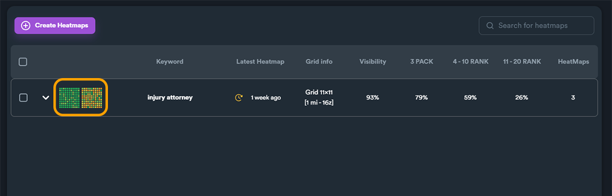
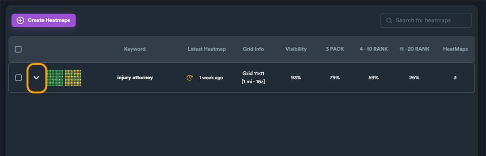
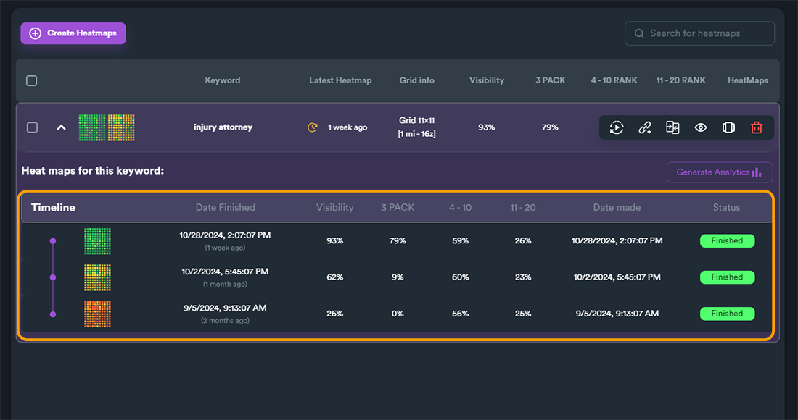
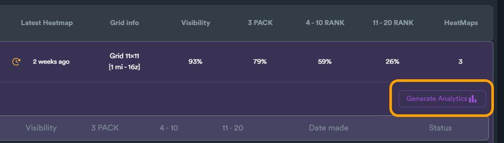
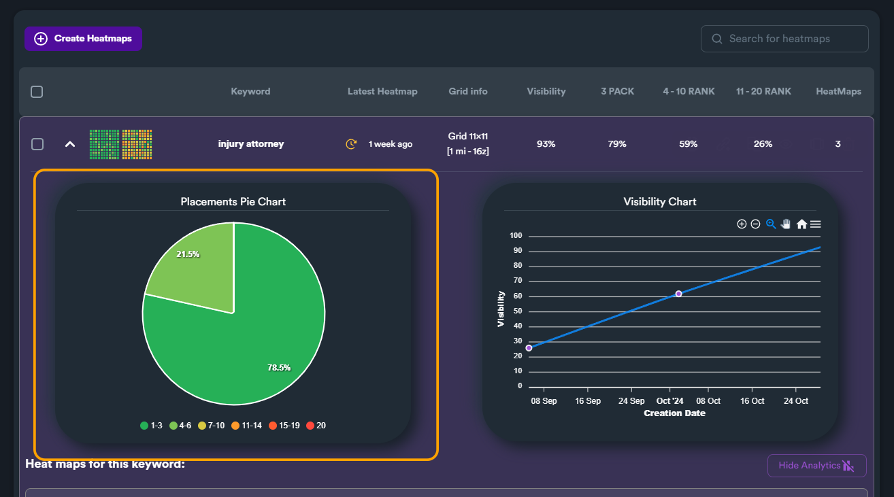

# Projects: Heatmap Results

### Generated Heatmaps - Status

While SEO Neo generates heatmap data for each keyword for the project there will be a blue dot. This is a status indicator, showing that these heatmaps are under processing.

<figure><figcaption></figcaption></figure>

When the heatmap generation process, a green border will indicate which heatmaps are **new** (not opened).

<figure><figcaption></figcaption></figure>

On opened/viewed heatmaps the green border along with the "**new**" label is removed.

<figure><figcaption></figcaption></figure>

***

### Heatmap Details

On heatmaps screen you can find different information about each heatmap. Keep in mind that for each keyword you have selected when you created the project, SEO Neo will generate a different heatmap. This gives the user the flexibility to track each keyword for each project seperately.

<figure><figcaption></figcaption></figure>

Along with basic information about each keyword/heatmap, SEO Neo will also display the last 2 generated heatmaps.

<figure><figcaption></figcaption></figure>

To expand the view for each keyword and view all heatmaps, click on the arrow button on the left side.

<figure><figcaption></figcaption></figure>

When you expand the keyword view, you can view details for all previously generated heatmaps for current keyword.&#x20;

<figure><figcaption></figcaption></figure>


It is **recommended** to run a heatmap for each keyword at least one per week when you take actions for your GBP in order to track your ranking changes/results.


Understanding different metrics about your heatmap is crucial. Here is a short explanation of different terms regarding heatmaps:

<table><thead><tr><th width="168">Term</th><th>Info</th></tr></thead><tbody><tr><td><strong>Visibility</strong></td><td>This is a metric that shows the overall visibility of your BGP in whole heatmap. It is calculated from the average of all rankings from all points of the heatmap.</td></tr><tr><td><strong>3 PACK</strong></td><td>Percentage of pins within the map that this keyword ranks for the first three positions (in search results).</td></tr><tr><td><strong>4 - 10</strong></td><td>Percentage of pins within the map that this keyword ranks for positions 4 - 10 (in search results).</td></tr><tr><td><strong>11 - 20</strong></td><td>Percentage of pins within the map that this keyword ranks for positions 11 - 20 (in search results).</td></tr></tbody></table>

### Keyword Heatmap Analytics

For further analytics for a selected keyword, click on "**Generate Analytics**" button. This will expand the view further showing you some rankings metrics for selected keyword.

<figure><figcaption>
"Generate Analytics" button
</figcaption></figure>

On the left side there is a placement pie chart. This pie chart shows number of placements for the keyword (in percentage value). For example, in the image below the keyword has:

* **21.5%** in positions 1 to 3
* **78.5%** in positions 4 to 6


Each value (which represents position in reach results) on pie chart is color-code. You can always refer to the legend with different colors under the pie chart. You can also hover on each pie chart section and a tools tip will inform you about the corresponding position.


<figure><figcaption>
Placement pie chart
</figcaption></figure>

On the right side you can find a line chart that show the progress of the visibility metric based on creation date (time).

<figure><figcaption></figcaption></figure>

