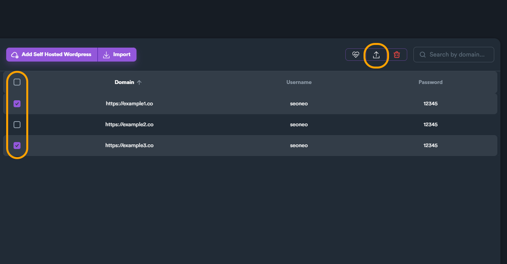
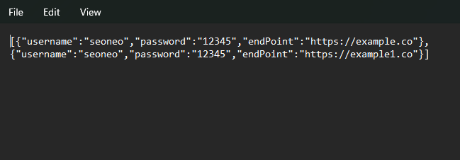

# Setup Account(s)

Before using Self-hosted Wordpress you will need to setup your account.

To do so, navigate to: **Accounts > "Self Hosted Wordpress"**.

From there you can add multiple accounts and organize them into folders.

<figure><figcaption></figcaption></figure>

To create an account, click "**Add Self Hosted Wordpress**" button.

<figure><figcaption></figcaption></figure>

A new pop-up window will appear where you will need to enter your **Domain**, your **Username** and **Password**.

<figure><figcaption></figcaption></figure>

When you finish click on "**Create**" button to create your account. You can also use hover over your created account and use the **test domain** button (a heart icon) to test your account credentials.

<figure><figcaption>
Use "test domain" function from hover buttons to check your credentials
</figcaption></figure>

***

## Which Password to use for your Self-hosted Wordpress Account ?

When you add a new **Self Hosted Wordpress** you need to enter domain, username and **password**. Although domain and username is standard for your Wordpress, this is not the case for the password.

There are two different scenarios / passwords you can use:

1. **Application Password** (generated within your Wordpress user account) - **recommended**
2. Your **account** password (which requires a plug-in) - **not** **recommended**.

### Using Application Password

To create an Application Password, from your Wordpress navigate: **Users > Profile.**

<figure><figcaption></figcaption></figure>

Write a name on "**New Application Password Name**" field.

<figure><figcaption></figcaption></figure>

Click on "**Add New Application Password**" button.

<figure><figcaption></figcaption></figure>

A new password has been generated. Copy that password and use it when you add a new Wordpress account on Self Hosted Wordpress.

<figure><figcaption></figcaption></figure>

***

### Your Account Password

If you want, you can also use your default Wordpress account password, without the need to create a new application password, but this method is not recommended.

If you want to use your account password, you will need to install **JSON Basic Authentication** **plug-in** for this method to work.

Download **JSON Basic Authentication** **plug-in** from the following link:



After downloading the plug-in, install it on your Wordpress site.

<figure><figcaption></figcaption></figure>

When you install the plug-in you need to activate it. Go to "**Installed Plugins**" where you will see all installed plugins. From there, locate "**JSON Basic Authentication**" plug-in and click "**Activate**".

<figure><figcaption></figcaption></figure>

You are now ready to use your own account password.

***

### Import/Export Self-Hosted WordPress Accounts

You can export your SHW (Self-Hosted WordPress) account using action menu button, after selecting at least one account from the list. You can also multiple-select and export your accounts in bulk.

<figure><figcaption></figcaption></figure>

Import SHW accounts generates a file that can be used to import your accounts back to SEO Neo again. If you want to import multiple SHW accounts, you can use this text template below.&#x20;

Open the template file and replace values (**username, password** and **endpoint** URL address).


Self-Hosted WordPress accounts template file


The file format is simple and its to alter values with a regular text editor.

<figure><figcaption>
Self-Hosted WordPress accounts template file - example
</figcaption></figure>


Keep in mind to keep structure of the file the same, otherwise it will not work when you will try to import it back to SEO Neo. You can replace "**username**", "**password**" and "**endPoint URL address**".\
\
When adding multiple accounts, keep the format and don't forget to add the comma "," character between account entries. The comma separator character should be on the last entry (check example image above).


