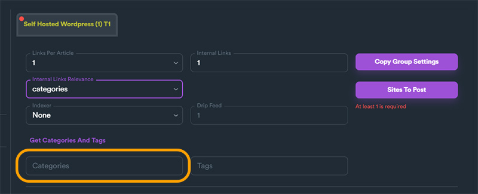
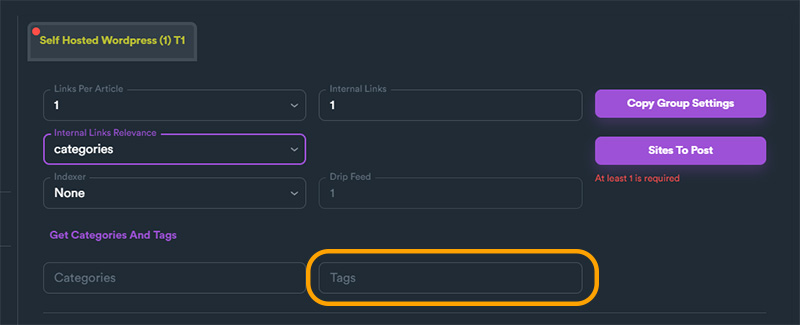

# Using Internal Linking

[**Internal Linking**](../features/internal-linking.md) feature can be used on campaigns that include Self Hosted WordPress link groups. To use this feature, you will first need to have access to OpenAI API.


**OpenAI API is required** to use Internal Links feature. If you need more help on how to use **OpenAI API key**, [**read this section**](../features/openai-for-content-buckets.md#generating-openai-secret-key-api-key).


## How Internal Links Work

SEO Neo uses your content from your content buckets and OpenAI to adjust your content/articles to include internal links. To do so, SEO Neo takes the content from your content bucket, it uses OpenAI integration to analyze the context of your content, and then adjusts the content to include internal links based on given user options.

<figure><figcaption>
Internal Links - Process
</figcaption></figure>

You can set internal link options from Self Hosted WordPress group options.

<figure><figcaption>
Internal Links options on Self Hosted WordPress group
</figcaption></figure>

In order to enable internal links, you need to set "**Internal Links**" number **greater than zero (0)**. SEO Neo has this option to zero by default, meaning that internal links is disabled. Changing this options effects the number of internal links you want to create on your articles.

The second option for internal links, is "**Internal Links Relevance**". This option effects how SEO Neo will create internal links.

Here are the different **Internal Links Relevance** options:

#### Random

SEO Neo creates internal links using any available post from your WordPress website.

#### Categories

Using this option will ensure that internal links will be from posts exclusively from selected group **category**.&#x20;

<figure><figcaption></figcaption></figure>

#### Tags

Selecting this option, you ensure the internal links will be from posts exclusive to selected group **tags**.

<figure><figcaption></figcaption></figure>

You can select only one of three different options on how SEO Neo will create (relate) internal links.&#x20;

## OpenAI and Interal Links

As we mentioned earlier, SEO Neo uses OpenAI integration in order to identify the context of your content. Keep in mind, that depending on **number of internal links** and the **size of your content** you will be charged OpenAI tokens accordingly.

