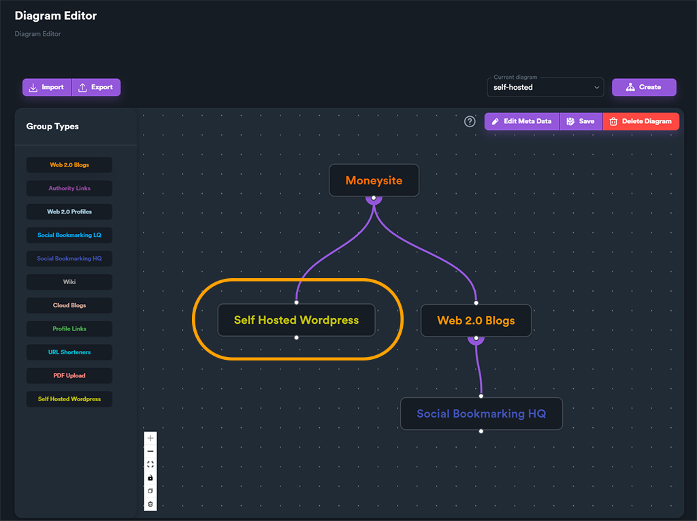

# Using Self Hosted Wordpress

In order to use **Self Hosted Wordpress** feature you need to have a diagram that includes at least one Self Hosted Wordpress group. After that you can create a campaign as normal.

<figure><figcaption></figcaption></figure>

When you create your campaign and select the Self Hosted Wordpress group you will see different options that we will explain below.

On the top of the group settings you will find options that are common with other group types, like: **Links per Article, Indexer, Copy Group settings** and **Sites to Post**. These options work the same way as they do in other groups **except from Sites to Post**.

Sites to post on a Self Hosted Wordpress group, lets you select which Wordpress sites you want to post. These sites are Wordpress sites that the user has created. We have explained how you set your Wordpress sites accounts [**on the previous section**](setup-account-s.md).

<figure><figcaption></figcaption></figure>

When you click on **Sites to Post** a new window will appear with all the Self Hosted Wordpress accounts you have set. In our example we will see only one account / wordpress site that we have set earlier.

<figure><figcaption></figcaption></figure>

This list of accounts may include a big number of accounts, so we have included a **search bar (1)**  and also a **folder filter (2)** - where you select only the specific folders you want to display accounts from.

<figure><figcaption></figcaption></figure>

Use the checkbox to select which accounts / Wordpress sites you want to post.

<figure><figcaption>
You need to select at least one account using checkbox
</figcaption></figure>

##

## Categories and Tags

The next section is about your Wordpress **Categories** and **Tags** that re used when you create a post.

<figure><figcaption></figcaption></figure>

Click on "**Get Categories And Tags**" button to fetch all categories and tags that are used on your account.

<figure><figcaption></figcaption></figure>

You can also enter new categories and tags on the corresponding fields. You need to press "**enter**" after each **category** or **tag**.

## Using Featured Images

Except from rich content like images, Wordpress posts may also include featured images. To manage and select featured images, click on "**Manage Featured Images**" button.

<figure><figcaption></figcaption></figure>

From this form you can upload and manage your featured images. To upload an image click on "**Drop or Select file**" or drag and drop image file on that area. You can select multiple image files if you want and then click "**Upload files**" button.

<figure><figcaption></figcaption></figure>

