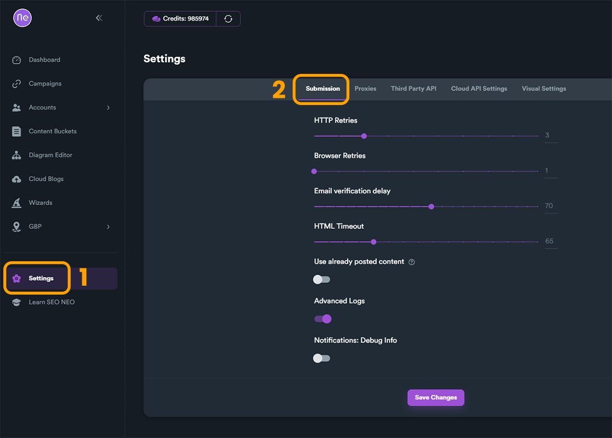
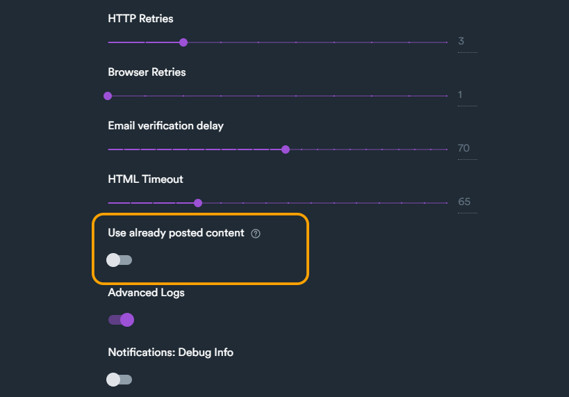
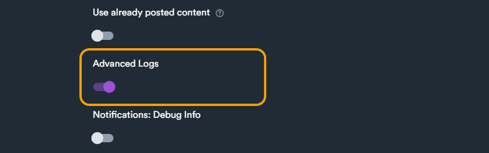
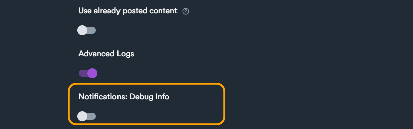
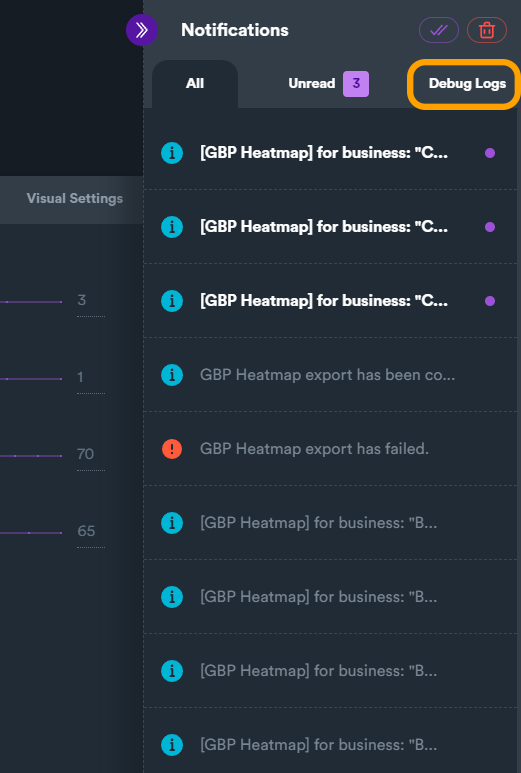

# Submission

Here the user can change different settings regarding SEO Neo submission.

This menu can be found:

1\) Go to **Settings**  (main side menu)

2\) Click on "**Submission**" tab

<figure><figcaption></figcaption></figure>

Submission settings include settings regarding how SEO Neo posting engine will behave while a campaign is running.&#x20;

<figure><figcaption></figcaption></figure>

**HTTP Retries**: How many retries the software will do (software retries after a failed task step) on websites that work with HTTP POST method.

**Browser Retries**: How many retries the software will do (software retries after a failed task step) on websites that work with browser.

**Email verification delay**: how much time (in seconds) the software waits after registration to verify verification emails.

**HTML Timeout**: how much time (in seconds) the software waits to load HTML on a task.

***

### Use already posted content

SEO Neo by default avoids using content from content buckets that is already used on another campaign/task. If you want to force SEO Neo to use the same content in different campaigns you can use the toggle button.

<figure><figcaption></figcaption></figure>

***

### Advanced Logs

Advanced logs will include advance and detailed information in SEO Neo logs.

<figure><figcaption></figcaption></figure>

***

### Notifications: Debug Info

Enabling this option will make debug information notifications available in **Notifications** section.

<figure><figcaption></figcaption></figure>

By default this options is disabled, if you enable this option, then in **Notifications** area SEO Neo will also display debug notifications. This is useful on debugging on when an error/issue occurs and the user wants to use that information for opening a ticket.

<figure><figcaption></figcaption></figure>
