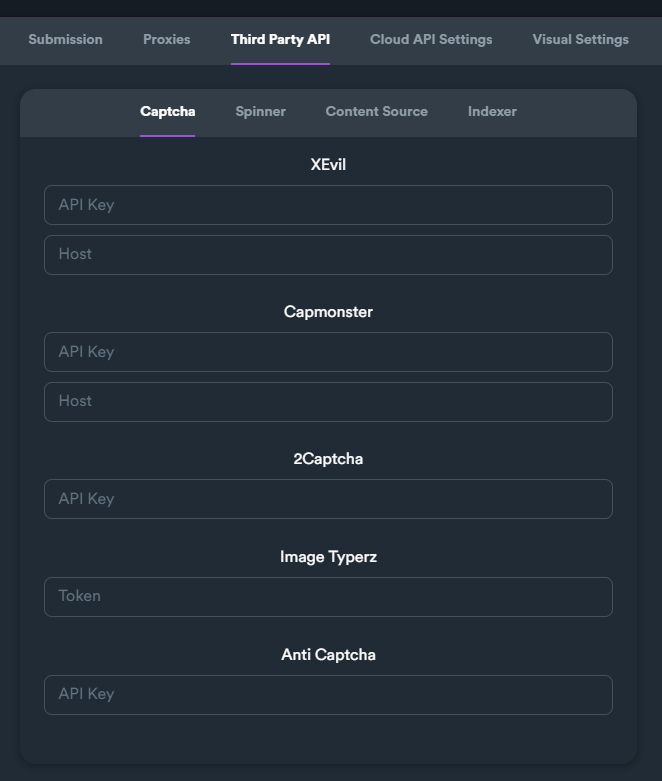

# Third Party API

Here the user can enter all credentials and API keys from 3rd-party services that are used from SEO Neo.

<figure><figcaption></figcaption></figure>

Third party APIs are separated into different sections/tabs according to service type.

These are the following categories where you can find all supported 3rd party APIs:

### Captcha

<figure><figcaption>
Captcha section on settings
</figcaption></figure>

For captcha solving services. This is the most important and absolutely required 3rd party API that should be used with the software in order to achieve high success rates.

Currently supported APIs for captcha solving:

* XEvil
* Capmonster
* 2Captcha
* Image Typerz
* Anticaptcha


It is highly recommended to use 2Captcha API as a captcha solving service. You can get your API from [**this link**](https://2captcha.com/?from=1577834).


### Spinner

<figure><figcaption>
Spinner section on settings
</figcaption></figure>

This service is used to create multiple variations from your articles and text bodies on your campaigns. You can always use the free built-in version of spinner, but using a 3rd party API will create better variations of your [spintax text](../../additional-information/glossary/spintax-format.md).

Currently supported APIs for creating spintax text:

* Spin Rewriter
* Word AI
* Spinner Chief
* Espinner

### Content Source

SEO Neo supports only Article Forge and Open AI. This service is used to generated high quality articles and text bodies based on different settings and given keyword.

Open AI is a revolutionary artificial intelligence language model that can give exceptional results on writing quality articles for your campaigns.

<figure><figcaption>
Content source section on settings
</figcaption></figure>


Using a content source service is recommended to create high quality articles for your campaigns. You can always create multiple variations from your fetched articles using spinners (see above section).


### &#x20;Indexer

This service allows your backlinks to get indexed after your campaign gets finished. If you select a spinner when creating a campaign, the campaign will get all created "submitted URLs" and send them to selected indexing service.

<figure><figcaption>
Indexer section on settings
</figcaption></figure>


Getting your backlinks indexed or crawled has a **huge impact** on your ranking results. It is **recommended** to use [**Omega Indexer**](https://www.omegaindexer.com/) as an indexer service and  [**Colinkri**](https://www.colinkri.com/) to boost your indexing results further.

