# Cloud Content Poster

Cloud Content Poster is a streamlined **utility wizard** designed to help you quickly create posts on your cloud blogs. It eliminates the need for setting up time-consuming campaigns, allowing you to effortlessly publish content on your uploaded cloud blogs.

To run this wizard navigate:

**Main menu > Wizards**

From Wizards screen select "**Cloud Content Poster**" wizard and click on "**Initialize**" button to launch it.

<figure>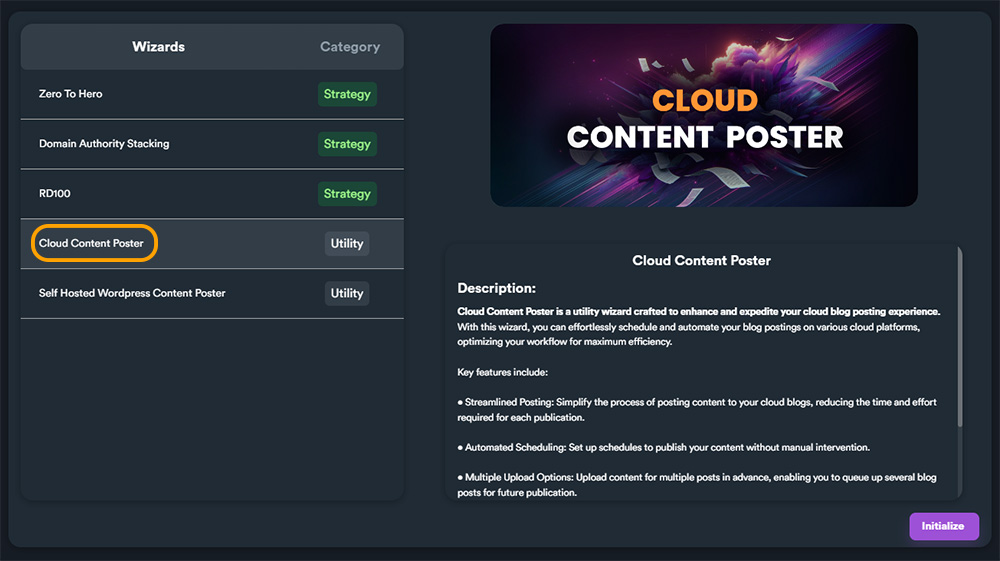<figcaption></figcaption></figure>

##

## How to Use Cloud Content Poster

This Wizard is broken into two steps:

<figure>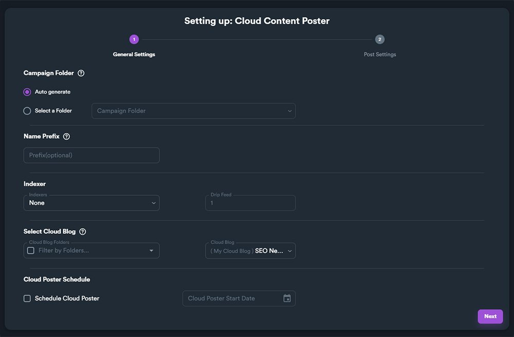<figcaption></figcaption></figure>

1\) General Settings

2\) Post Settings

Let's go and set each available option on this wizard.

## Step 1 - General Settings

### Campaign Folder

<figure>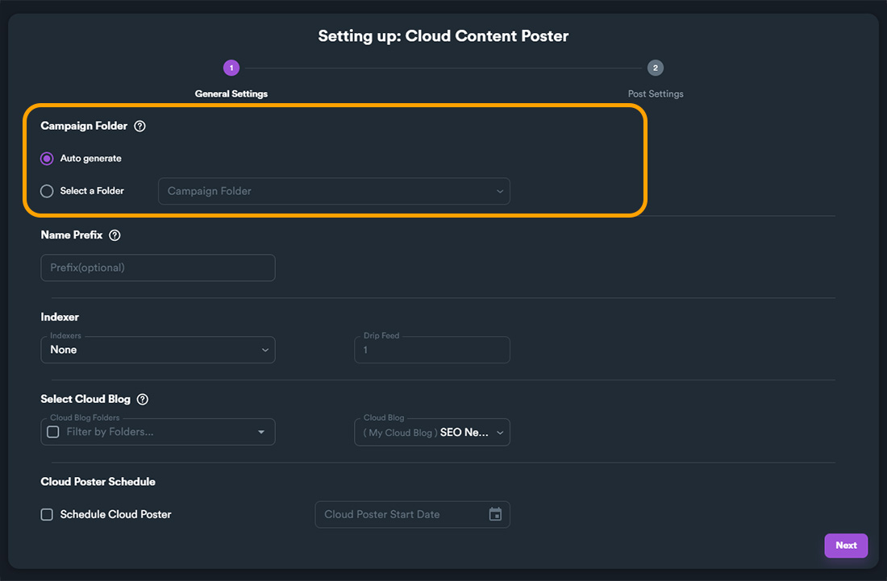<figcaption></figcaption></figure>

In this option you select where you want the wizard to store generated campaign. The default option is "**Auto generate**" which generates a new folder automatically.&#x20;

If you want the wizard to store the new campaign into a specific folder you can select "**Select a Folder**" radio button and use the drop-down menu to select a specific folder.

<figure>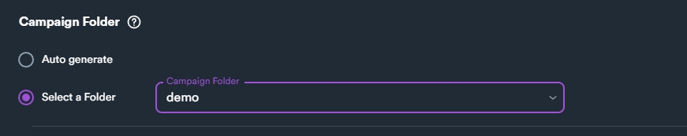<figcaption>
Example of selecting a specific folder for generated Wizard campaign
</figcaption></figure>

### Name Prefix

<figure>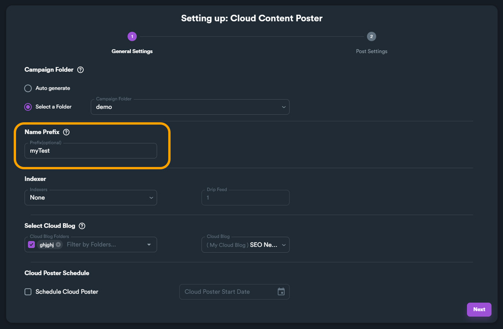<figcaption></figcaption></figure>

**Name prefix** gives a prefix on generated campaign name to help you identify it later. Name prefix is optional but it is recommended if you want to keep your campaigns better organized.

### Indexer

<figure>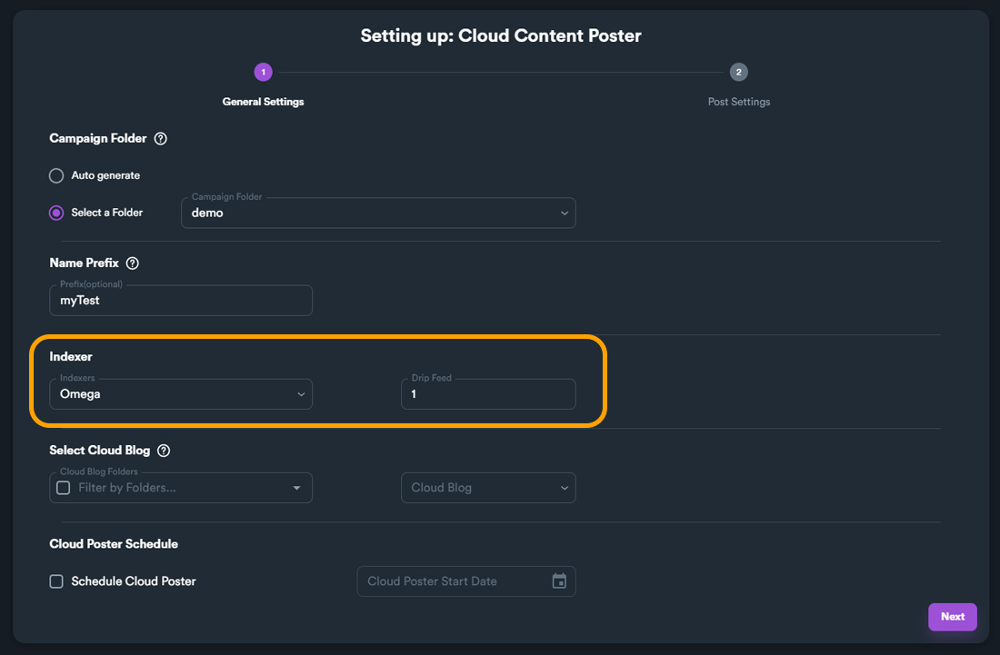<figcaption></figcaption></figure>

This is the same option that you can find also in other SEO Neo sections (for example when you create a new campaign). You can select an indexer to use for your cloud blogs posts.


It is **recommended** to use [**Omega Indexer**](https://www.omegaindexer.com/) or [**Colinkri**](https://www.colinkri.com/) if you want better results with indexing your cloud blog posts.&#x20;

If you need more information on how to setup an indexer [**read this section**](../../quick-start/creating-your-1st-campaign/before-creating-your-campaign/basic-settings.md#indexers) of our documentation.


### Select Cloud Blog

<figure>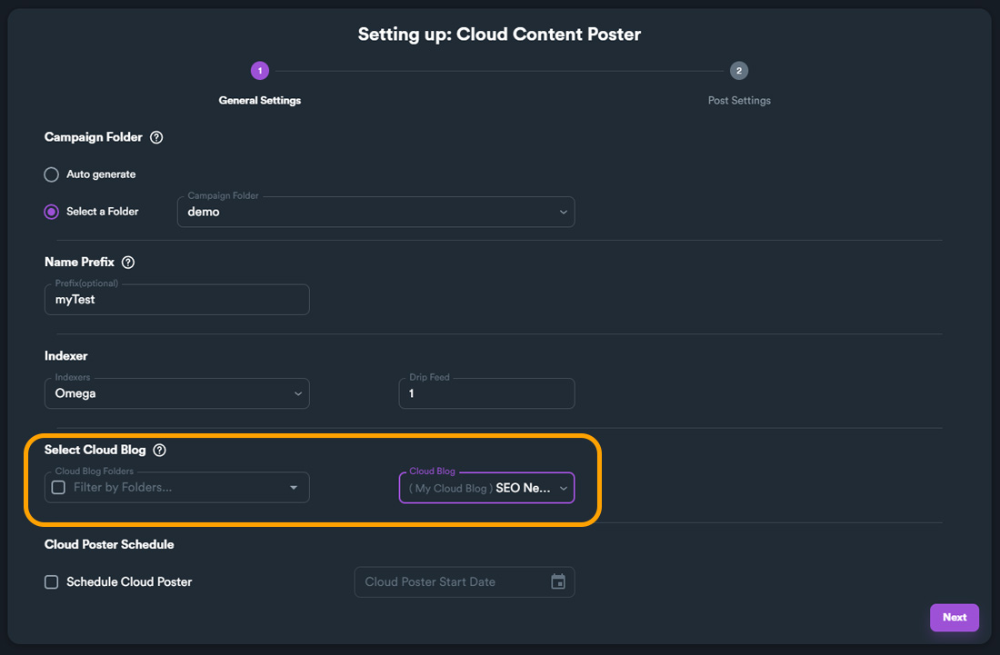<figcaption></figcaption></figure>

In this section you select which cloud blog you want to use to create your posts. You can filter-out your already generated cloud blogs by folder (using the left drop-down menu and selecting a folder).&#x20;


If you want to create posts on a cloud blog, a cloud blog **must be already uploaded**. For more information on how to generate and upload cloud blogs, [**read this section of the documentation**](../cloud-blogs/cloud-blogs-generator.md).


### Cloud Poster Schedule

<figure>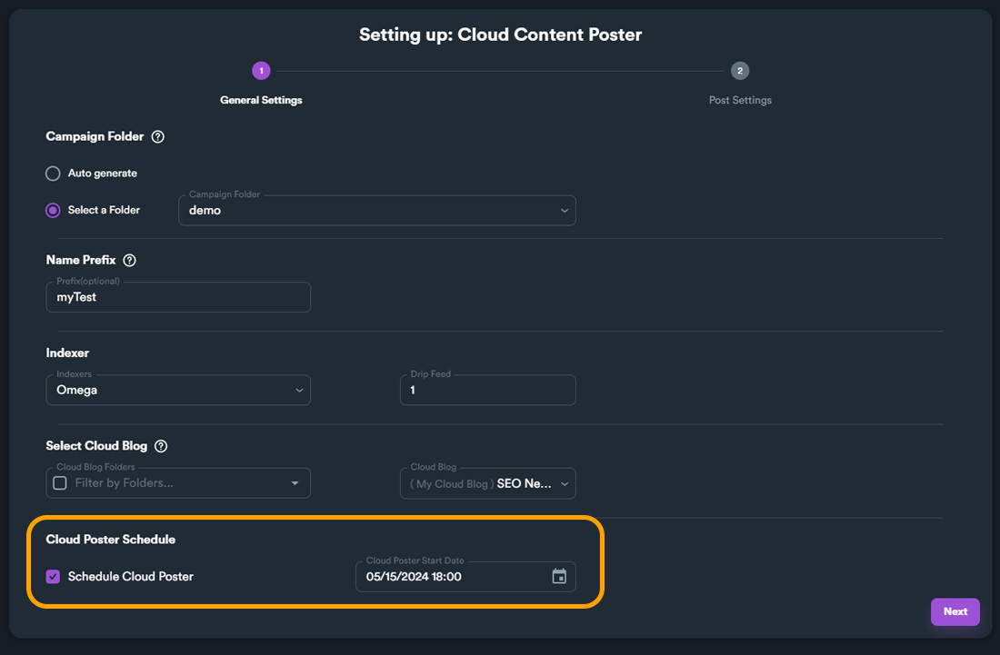<figcaption></figcaption></figure>

This option is optional but is very useful. You can check "**Schedule Cloud Poster**" option and select a date and time (by clicking on the box on the right side).

<figure>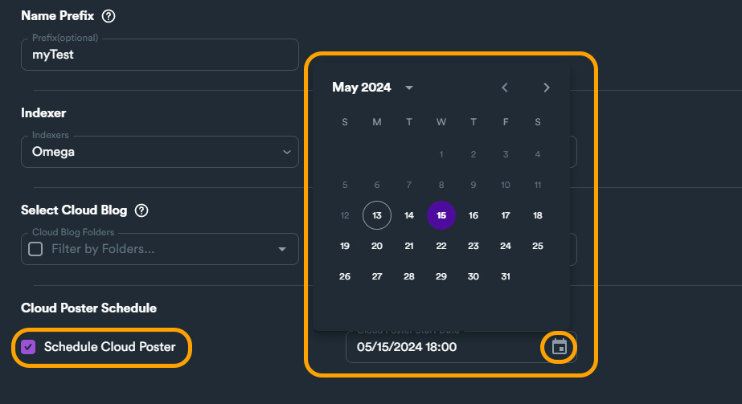<figcaption></figcaption></figure>

When you finish with General Settings click on "**Next**" button to navigate to the second step of the wizard.&#x20;

## Step 2 - Post Settings

This step includes all the options to define your posts on your cloud blog (the one you selected on the previous step).

<figure>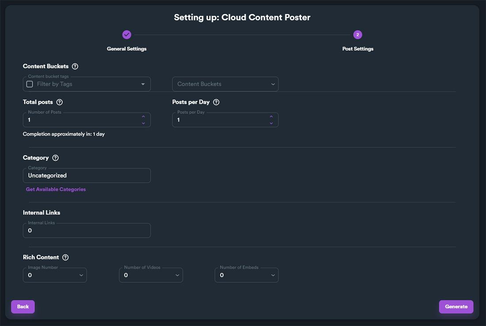<figcaption></figcaption></figure>

### Content Buckets

<figure>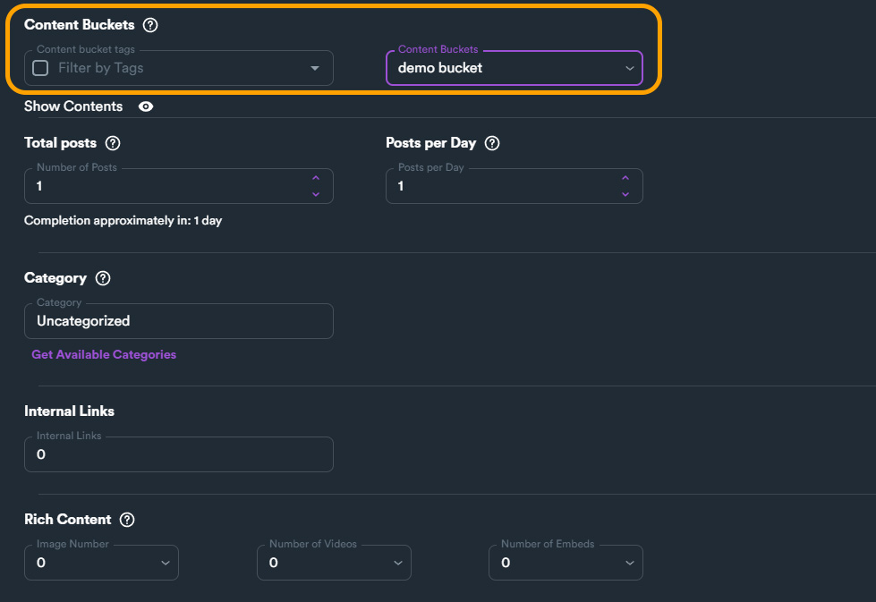<figcaption></figcaption></figure>

To create posts on your cloud blog **you need to select a content bucket**. Select a content bucket that includes content that you want to post on your cloud blog. This means that your content bucket you select must include at least one article.


Make sure you have created **all content types** inside your content bucket including:\
**Articles, Short Descriptions, Bios, Rich Content and Blog Details**. Your cloud blog posts will utilize all content types when applicable.

It is **recommended** to select a content bucket that includes **rich content** (image & video URLS etc.)

If you want to learn more on creating content buckets you [**can read this section of the documentation**](cloud-content-poster.md#content-buckets).

You can also [**watch this video**](https://www.youtube.com/watch?v=t1bJeJR3Wpg) that explains how content buckets work.


### Total Posts & Posts Per Day

<figure>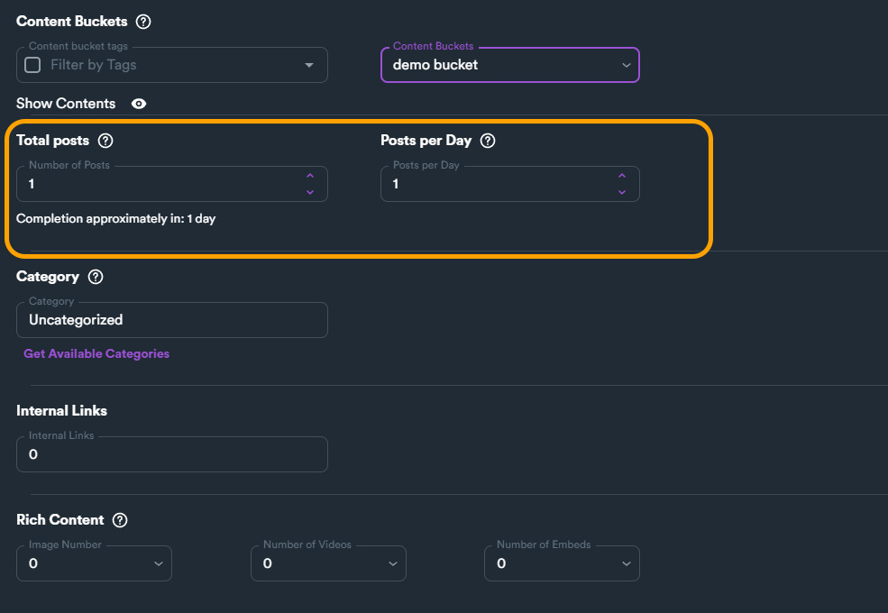<figcaption></figcaption></figure>

This section is very important as it defines the number of posts and how many posts you want SEO Neo to post on your cloud blog per day.


On "**Number of Posts**" you can select a **maximum** of **1000** total posts


Each cloud blog post will use a different article from your content bucket. The number of total posts will also determine the number of articles you need to include in your content bucket.&#x20;


**Example:**

If you need to create 30 posts on your cloud blog, you will need at least 30 articles in your content bucket you've selected.


To help you with your content you will need inside your content bucket, you can click on "**Show Contents**" eye icon. After clicking this icon, SEO Neo will display basic information on what it is included inside selected content bucket.

You can hover each icon on the expanded section to display a tooltip indicating each content type.

<figure><figcaption></figcaption></figure>

In our example below, we have selected **Number of Posts = 1**. The first icon in "Show Contents" indicates that our selected content bucket includes one article. This setup is fine, as wee need only one article.

<figure><figcaption>
The first content type (Articles) is marked as required.
</figcaption></figure>

Now let's try to increase the number of **total posts** to 10 to see what will happen.

<figure><figcaption></figcaption></figure>

As we can see, SEO Neo raised an alert. This is because we have selected **10 total posts** but our content bucket only includes **1 article**.


As a rule of thumb, if you have **N total posts**, you should have at least **N articles** inside your content bucket.


The next option in this section is **Posts per Day**. As the name suggests this sets the number of posts your want SEO Neo to post on your blog per day. You can set a **maximum** of **100 posts per day**.

<figure>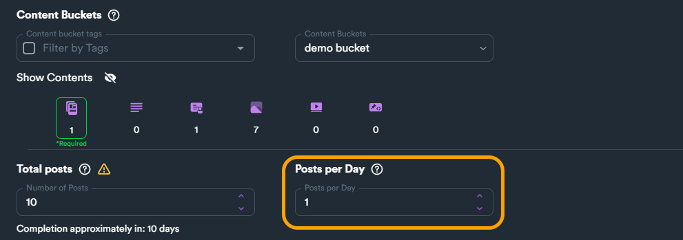<figcaption>
Set the number of posts per day
</figcaption></figure>

### Category

### Internal Links

### Rich Content

