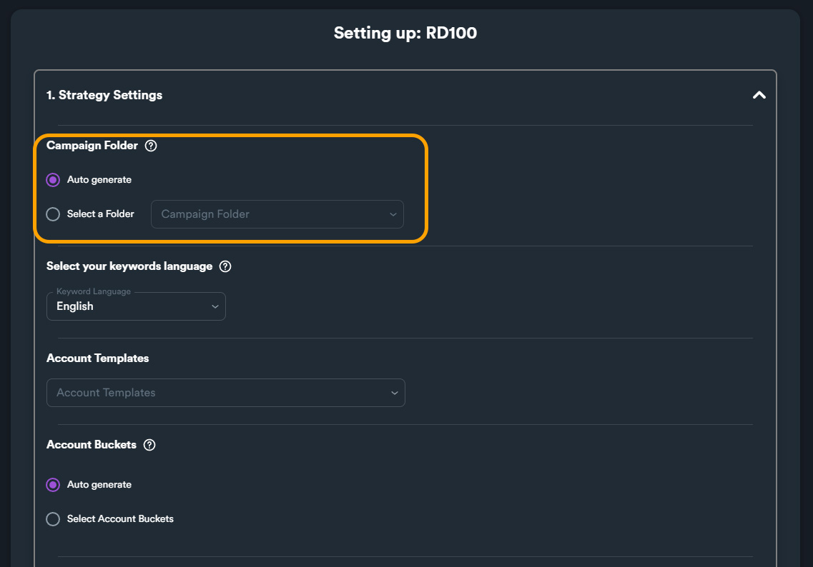
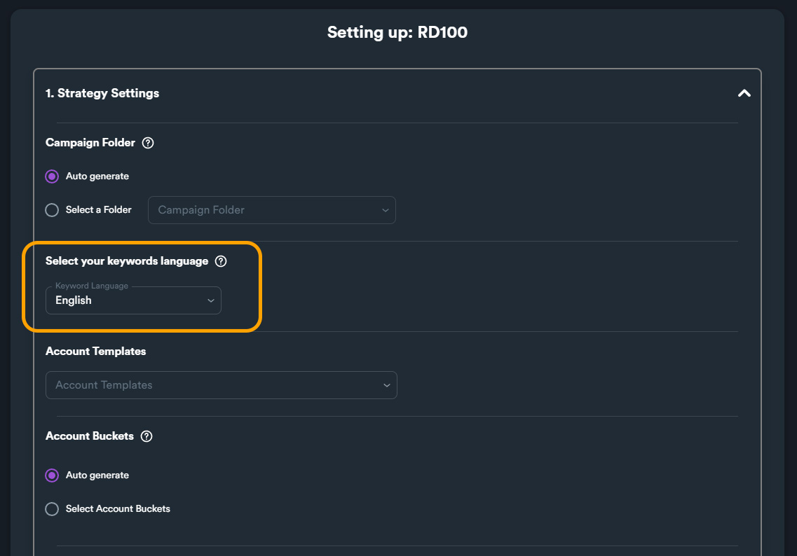
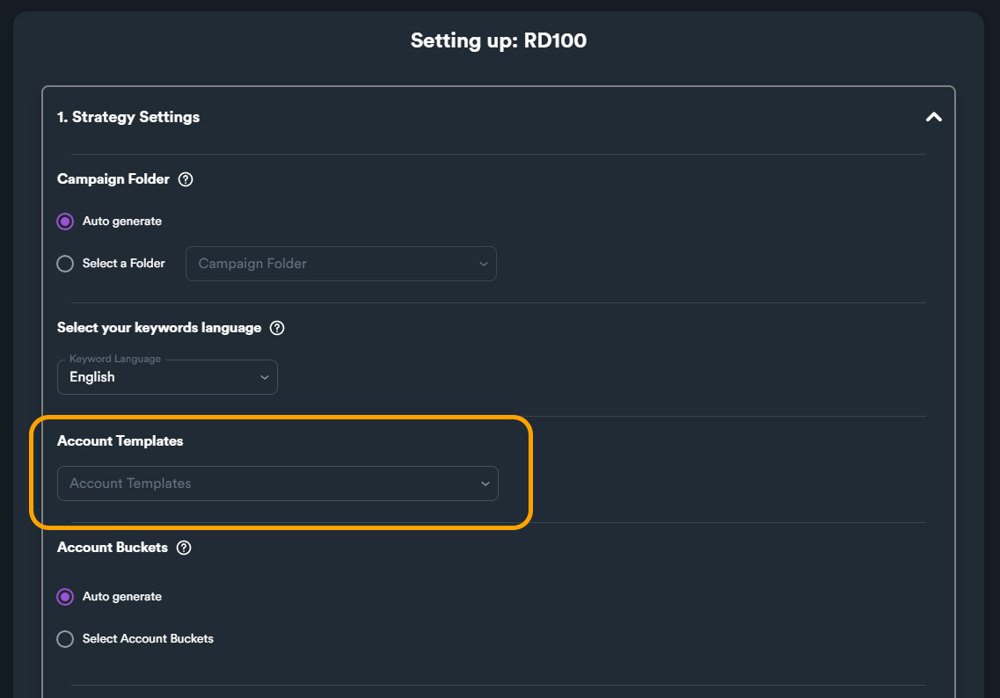
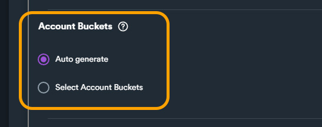
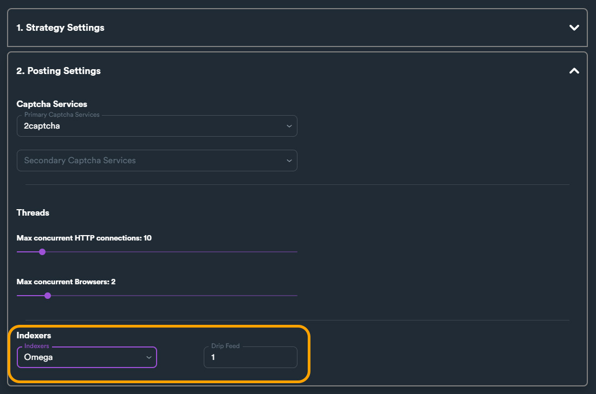

# RD100

## **About RD100 Strategy**

**RD100** is a **strategy** wizard that help you setup a powerful SEO strategy. With this strategy you can pass a huge amount of Authority from your Tier 1's directly to your money site URLs.


You can **use RD100** strategy to boost **press release URLs, guest post URLs, PBN links, authority links, citations** and **social media URLs**.


Below is a video about this strategy and how you can create from scratch using SEO Neo. To view the video, click on the thumbnail below.



## Why Use RD100 Wizard

Although you can create a campaign in SEO Neo that utilizes this strategy (using available RD100 diagram) the campaign will fit the needs of only one URL. When you select RD100 diagram from available diagrams it is indicated that its **suitable for one URL**.

<figure><figcaption></figcaption></figure>


**Neo - RD100(1URL)** is suitable for a campaign with one money site URL.


This wizard creates a more advanced setup of the strategy by generating multiple campaigns based on given money sites. With this wizard you make sure that each URL of your money site will get a huge amount of authority.

## How to use RD100 Wizard

To run this wizard navigate:

**Main menu > Wizards**

From Wizards screen select "**RD100**" wizard and click on "**Initialize**" button to launch it.

<figure><figcaption></figcaption></figure>

### Using RD100 Wizard

This Wizard is broken into two steps:

<figure><figcaption></figcaption></figure>

1. Strategy Settings
2. Posting Settings

##

## 1 - Post Settings

### Campaign Folder

<figure><figcaption></figcaption></figure>

In this option you select where you want the wizard to store generated campaign. The default option is "**Auto generate**" which generates a new folder automatically.

If you want the wizard to store the new campaign into a specific folder you can select "**Select a Folder**" radio button and use the drop-down menu to select a specific folder.

### Keyword Language

<figure><figcaption></figcaption></figure>

With this option you select the language of your keywords.&#x20;

### Account Templates

<figure><figcaption></figcaption></figure>

Select which account template you want to use.

For more information about account templates [**read this section**](rd100.md#account-templates) of the documentation or [**watch this video**](https://www.youtube.com/watch?v=q-Yxap82F5U).

### Account Buckets

<figure><figcaption></figcaption></figure>

Select which account bucket you want to use. You can let SEO Neo generate an account bucket automatically (**Auto generate**) or select an existing account bucket (**Select Account Buckets**).

For more information about accounts buckets [**read this section**](rd100.md#account-buckets) of the documentation or [**watch this video**](https://www.youtube.com/watch?v=E-rS94B5\_MM).

### Content Bucket

<figure><figcaption></figcaption></figure>

Select a content bucket that includes content **relevant** to your money site's niche.


Make sure you have created **all content types** inside your content bucket including: **Articles, Short Descriptions, Bios, Rich Content and Blog Details**. Your cloud blog posts will utilize all content types when applicable.

It is **recommended** to select a content bucket that includes **rich content** (image & video URLS etc.)

If you want to learn more on creating content buckets you [**can read this section of the documentation**](https://docs.seoneo.io/documentation/wizards-under-construction/cloud-content-poster#content-buckets).

You can also [**watch this video**](https://www.youtube.com/watch?v=t1bJeJR3Wpg) that explains how content buckets work.


### Money Sites

<figure><figcaption></figcaption></figure>

Enter all available URLs from your money site. It is recommended to use different URLs from your money site including:

* Press release
* Guest post
* PBN links
* Authority links
* Citations
* Social media

When you generate this strategy, this wizard will generate a campaign per money site URL.


There is a **limit** of **100 Money Site** URLs.


### Primary Keywords

<figure><figcaption></figcaption></figure>

Enter keywords related to your Money Site's URLs niche.&#x20;


Enter your **best targeted keywords**. These keywords will be used in various ways within this strategy.


## 2 - Post Settings

### **Captcha Services**

<figure><figcaption></figcaption></figure>

You set which captcha service you want to use for generated wizard campaign/campaigns. You can select **Primary** and **Secondary Captcha** service. The Secondary Captcha service is optional and will be used whenever the first (primary) captcha service fails to solve.


It is highly recommended to use 2Captcha API as a captcha solving service. You can get your API from [**this link**](https://2captcha.com/?from=1577834).


### **Threads**

<figure><figcaption></figcaption></figure>

Here you can change how many threads will be used for generated wizard campaign/campaigns. On some sites SEO Neo uses HTTP requests to create posts, and other sites use browser. You can change threads usage independently for each method.

### Indexer

<figure><figcaption></figcaption></figure>

This is the same option that you can find also in other SEO Neo sections (for example when you create a new campaign). You can select an indexer to use for your cloud blogs posts


It is **recommended** to use [**Omega Indexer**](https://www.omegaindexer.com/) or [**Colinkri**](https://www.colinkri.com/) if you want better results with indexing your cloud blog posts.

If you need more information on how to setup an indexer [**read this section**](https://docs.seoneo.io/quick-start/creating-your-1st-campaign/before-creating-your-campaign/basic-settings#indexers) of our documentation.


