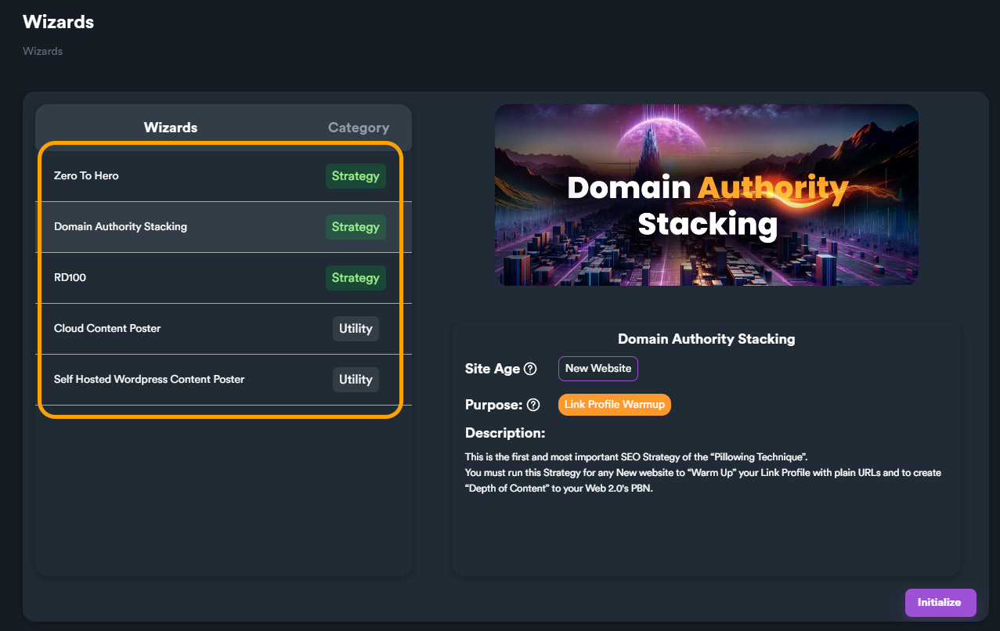

# Wizards



**Wizards** is a suite of powerful built-in tools designed to help users leverage the capabilities of SEO Neo in a more intuitive, step-by-step manner. When you select a **Wizard**, SEO Neo will guide you through each step to simplify and expedite the completion of complex tasks.

You can access Wizards list by clicking "**Wizards**" button from main menu.

<figure><figcaption></figcaption></figure>

From this screen you can select a wizard from the list on the left side. For each wizard there is a detailed description on the right side including: wizard category (Strategy or Utility), purpose and description, site age and other useful information for selected wizard.

<figure><figcaption></figcaption></figure>

## Wizard Types

Each wizard can belong to one of two types: **Strategy** or **Utility**.

A **strategy-type wizard** guides the user through a step-by-step process to create a comprehensive SEO strategy by employing various SEO Neo campaign types and keyword strategies. Think of a strategy as a recipe that combines different campaigns, interlinking them to form a complex SEO strategy that would be challenging and time-consuming to construct manually.

<figure><figcaption></figcaption></figure>

A **utility-type wizard**, while similar to a strategy-type, primarily aims to **simplify** redundant and time-consuming SEO Neo operations rather than create complex SEO strategies. For instance, the "**Cloud Content Poster**" utility wizard assists users in posting to their cloud blogs. The user simply selects their cloud blog, inputs the content, adjusts any additional settings, and the wizard automatically generates a custom campaign for this task.

## Wizards List

Here is a table with currently available Wizards. SEO Neo team works hard to develop and integrate new wizards on next updates.

<table><thead><tr><th width="282">Wizard Name</th><th width="106">Type</th><th>Description</th></tr></thead><tbody><tr><td><a href="wizard-zero-to-hero.md">Zero to Hero</a></td><td>Strategy</td><td>A complex strategy that combines <strong>authority stacking</strong>, <strong>warm up</strong> and <strong>advanced ranking</strong> techniques.</td></tr><tr><td><a href="wizard-domain-authority-stacking.md">Domain Authority Stacking</a></td><td>Strategy</td><td>A very useful strategy to "<strong>warm up</strong>" new websites.</td></tr><tr><td><a href="wizard-rd100.md">RD100</a></td><td>Strategy</td><td>Power each Tier1 URL with at least <strong>100</strong> different <strong>Referring Domains</strong>.</td></tr><tr><td><a href="wizard-cloud-content-poster.md">Cloud Content Poster</a></td><td>Utility</td><td>A simple wizard to help you <strong>create</strong> and <strong>schedule</strong> posts on your cloud blogs.</td></tr><tr><td><a href="wizard-self-hosted-wordpress-poster.md">SHW Content Poster</a></td><td>Utility</td><td>A simple wizard to help you <strong>create</strong> and <strong>schedule</strong> posts on your Self-Hosted WordPress websites.</td></tr></tbody></table>

