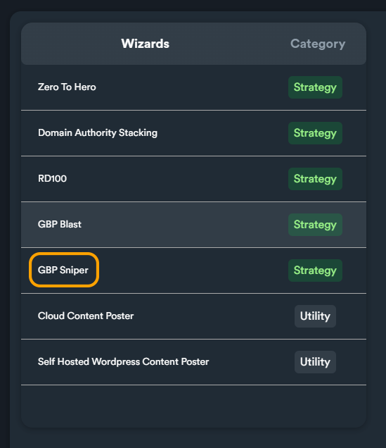

# Wizard: GBP Sniper

### GBP Sniper Introduction

GBP Sniper is a powerful wizard that generates advance SEO strategy campaigns for local SEO. This strategy creates authority both on GBP and the overall brand.


**Important:** When you run the wizard for the first time SEO Neo will use the **GBP cid URL**. The second time you run the wizard, you will be prompt to use the **GBP place id URL** (instead of **cid**).


### How to use "GBP Sniper" Wizard

To run this wizard navigate:

**Main menu > Wizards**

From Wizards screen select "**GBP Sniper**" wizard and click on "**Initialize**" button to launch it.

<figure><figcaption></figcaption></figure>

***

### 1 - Campaign Settings

This wizard contains 2 steps: **(1) Campaign Settings** and **(2) GBP Moneysites and Keywords**.

On 1st step there are two sections that ypu can expand and collapse by clicking on the arrow buttons on the right side.

<figure><figcaption></figcaption></figure>

Select your campaign folder

<figure><figcaption></figcaption></figure>

Next there is an option to add two additional link groups (Cloud Blogs and Self-Hosted WordPress) intro the strategy. If you enable any of these yours, the wizard will add them dynamically and will utilize them. These two additional groups are optional and you can enable/add both, one of them or both of them.

<figure><figcaption></figcaption></figure>

To enable any of these additional groups, click on toggle button. If you enable any group, you will need to select an account (a cloud blog or a self-hosted WordPress of your own).

<figure><figcaption></figcaption></figure>


To **use these additional link groups** you need to already have set a self-hosted WordPress account or in case of cloud blogs, you need to have created a cloud blog.

For more information about **Cloud Blogs** and **Self-Hosted WordPress** link groups, read the related documentation sections:

* [**Cloud Blogs**](../cloud-blogs/)
* [**Self-Hosted WordPress**](../self-hosted-wordpress/)


The next option is **Account Template**. You can select your account template from the drop-down menu.

<figure><figcaption></figcaption></figure>

Next, select your **Account Bucket**. You can select an existing account bucket or let SEO Neo generate a new one based on wizard's strategy.

<figure><figcaption></figcaption></figure>

The select the content bucket that will be used for posting content. Your content bucket should include the following content types:

* Articles
* Descriptions
* Bios
* Comments

If you want to use rich content (it's recommended), then keep in mind to include rich content inside your selected content bucket.


You can always create a new (**empty**) content bucket by clicking the "**plus-symbol**" icon. Keep in mind that it is **very important to fill** that empty content bucket with content after you generate the strategy campaign. You need to fill it **before running the campaign**, otherwise the bucket **will remain empty** and no content will be able to be used by SEO Neo.


<figure><figcaption></figcaption></figure>


For more information on how to create content buckets and add different content types inside them, [**read this section**](../content-buckets/) of the documentation.


***

### Posting Options

To navigate to the second section of the wizard, click on the arrow on the right side to expand the section.

<figure><figcaption></figcaption></figure>

In this section you can change different post settings. These settings are similar to any other posting settings within SEO Neo. These settings include: selecting Captcha Services, Threads and an Indexer.


For **indexing** service we highly recommend using [**Omega Indexer**](https://www.omegaindexer.com/) which has very high indexing success rate.


When you are ready with posting options, click on "**Next**" button to go to the second part of the wizard.

***

### 2 - GBP Moneysites and Keywords

Select a GBP project

<figure><figcaption></figcaption></figure>

Add your business website URLs. You can add multiple URLs (one per line).


We recommend adding **About Us** and **Contact Us** URLs from your website.


<figure><figcaption></figcaption></figure>

Then fill the GBP URLs from your Google Business Profile. These URLs include:

* GBP cid URL
* GBP Reviews URL
* GBP About us URL
* GBP Post URL

<figure><figcaption></figcaption></figure>

When you select the project inside the wizard the first two URLs (**GBP cid, GBP Reviews**) are scrapped and fetched automatically (if available). The rest two (**GBP About us URL, GBP Post URL**) should be filled manually by the user.

<figure><figcaption>
Some URLs are automatically filled by the wizard, based on selected project
</figcaption></figure>


After using the wizard for the first time and filling **GBP About us** and **GBP Post URL**, the wizard will automatically fetch those URLs if you run it again in the future.


Next fill your social media URLs (use one URL per line). The **more social media platforms** you include in this section the greater the reach and impact.

<figure><figcaption></figcaption></figure>

The last thing you need to enter is your primary keywords. You can also import keywords from another GBP project or a GBP Keyword Bucket.


For more information on **importing** keywords from **GBP project** or **GBP Keyword Bucket** [**read this section**](wizard-gbp-blast.md#import-gbp-keywords) of the documentation.


After filling your primary keywords, click on "**Generate**" button and the wizard will generate an advance strategy campaign based on your selected options on previous steps.
