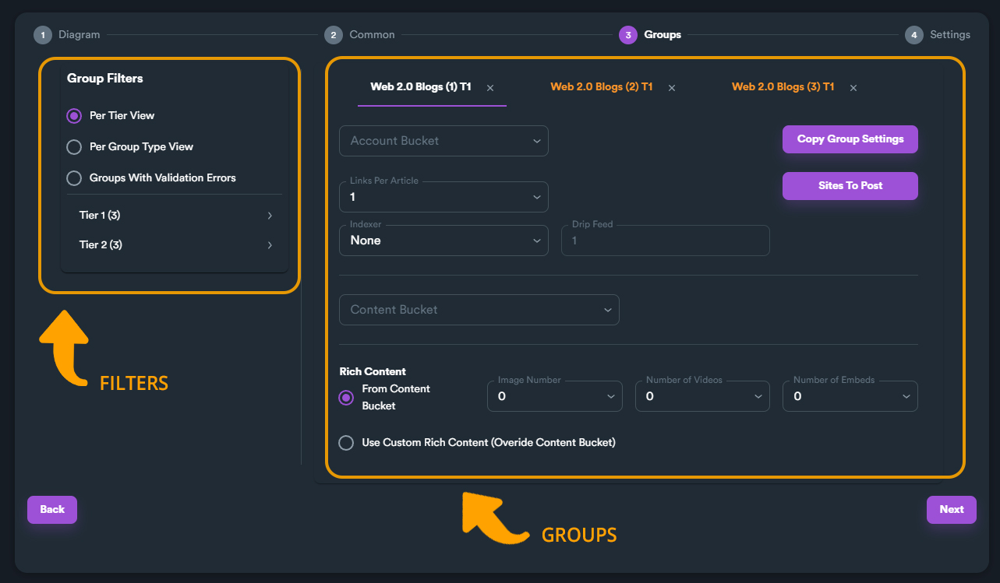

# 3 - Groups

On this step, you setup each link group separately. This includes: account preset, number of links, content bucket and other settings.


Some link group may have different settings depending on group type. For example Web 2.0 Blogs have settings for rich content but URL Shorteners only have&#x20;


### Main sections

There are two main sections on Groups step: filters (on the left side) and group settings (on the right side).

<figure><figcaption></figcaption></figure>

### Group Filters

From group filter you can change the view on groups. Using different group filter criteria will change which groups will be shown.

Selecting different group filter **(1)** will show different sub-filters **(2)**.

<figure><figcaption>
Group filters (1) , Sub-filters (2)
</figcaption></figure>

In our example if you choose "**Per Group Type View**", SEO Neo will show the different group types sub-filters. In this case its Web 2.0 Blogs (three groups) and URL Shorteners (three groups).

<figure><figcaption></figcaption></figure>


Filter "**Groups With Validation Errors**" will show only groups that have validation errors (omitted or wrong settings from user.)


### Setting Groups

Let's choose "**Per Group Type View**" and then choose "**Web 2.0 Blogs**". This will only show Web 2.0 Blogs groups.

<figure><figcaption></figcaption></figure>

Now we can start setting each group separately. In our campaign we have three different Web 2.0 Blogs, so on each group tab you can see a number to help you identify each group.

<figure><figcaption></figcaption></figure>

The first Web2.0 Blogs is selected as default. You can change between each group by clicking on each group tab.

### Account Bucket

From this menu we can change which account preset you want to use for this group.

In our example we will select the only account preset created "my accounts".

<figure><figcaption></figcaption></figure>

### Links Per Article

This number sets the amount of links each generated article (post) will have when the campaign runs.

For this guide we will set value 2.

<figure><figcaption></figcaption></figure>


You can set **Links Per Article** from "**0 - 5**" or even "**random**".

Setting "**0**" means that there will be no links on each posted article.

Setting "**random**" will choose a random value between "**0 - 5**".


### Indexer

Choosing an Indexer is optional but **highly recommended** (for better SEO ranking results).&#x20;

You can choose any available Indexer service and also set "[**Drip Feed**](../../../additional-information/glossary/drip-feed.md)" (how many days you want the indexing service to drip feed the links for a more "natural" behavior for search engines).

<figure><figcaption></figcaption></figure>


In order to select an Indexer you must [**setup the indexer service**](../before-creating-your-campaign/basic-settings.md#1.-set-your-proxies) (API Key) from SEO Neo's settings.


### Content Bucket

From the drop-down box you can select which content bucket you want to use for this group.

In SEO Neo you can set different sources for each group which makes your SEO campaigns very flexible.

In our case we will select the content bucket we have created before in our guide named "car sales".

<figure><figcaption></figcaption></figure>


You **need at least one content bucket** in order to proceed with campaign creation. If you have not followed required steps before creating your campaign read [**this documentation section**](../before-creating-your-campaign/).


### Rich Content

<figure><figcaption></figcaption></figure>

The default value for rich content is "**From Content Bucket**", which means this group will get rich content (images, video URLs etc.) from selected content bucket.

<figure><figcaption></figcaption></figure>

From the three drop-down menus you can select how many images, videos or embeds you want SEO Neo to use (from content bucket) for each post.

In our case we have selected to use one image and one video URL for each post.

<figure><figcaption></figcaption></figure>

### Overide Rich Content Settings

Although our content bucket already includes rich content, in SEO Neo, you can overide rich content from selected content bucket. To do so, choose "**Use Custom Rich Content**".

<figure><figcaption></figcaption></figure>

When you enable this option, a new sub-section will appear where you can enter custom URLs for each content type.

<figure><figcaption></figcaption></figure>

You can even set the position in article along with the number of URLs to be used.

<figure><figcaption></figcaption></figure>

If you don't have any rich content URLs you can use "**Scrape**" button and SEO Neo will scrape urls based on criteria.

<figure><figcaption></figcaption></figure>

In this tutorial we will use the default value "**From Content Bucket**" because the selected content bucket has some rich content entries.

<figure><figcaption></figcaption></figure>

### Sites To Post

In SEO Neo you can select which sites you want to post. You can select different sites for each group.

To select which sites you want to use for this group, click on "**Sites To Post**" button.

<figure><figcaption></figcaption></figure>

**Sites To Post** menu will display all available sites for this group along with some additional information like: **Domain Authority** for each website and **how many sites** are selected.

By default, all sites all pre-selected.

<figure><figcaption></figcaption></figure>

You can use the checkbox on the left to select / deselect each site separately.

<figure><figcaption></figcaption></figure>


Different group types will show different websites to select from.


You can even use the search bar on top of the menu, to find specific websites to enable/disable.

<figure><figcaption></figcaption></figure>

Let's select only the first five sites available from the list. To do so, deselect all sites using the top-left checkbox. Then select the first five sites from the list.

<figure><figcaption></figcaption></figure>


When you finish, click anywhere outside of the pop-up menu to confirm your selection.


### Copy Group Settings

Using different settings for each group give high flexibility, but in our case, we will use the same settings for the rest two Web2 .0 Blogs. We will do so, in order to demonstrate copy function between groups.

You can find "**Copy Group Settings**" button on the top right section.

<figure><figcaption></figcaption></figure>

When you click the button, a drop down menu appears with different options on which settings you want to copy.

The first option "**Copy All Settings**" copies everything. Every other options copies specific settings.

<figure><figcaption></figcaption></figure>

After selecting what you want to copy, a pop-up window will appear asking the user which are the target groups for the settings you copied.

You can copy-paste settings to: **All Tiers**, **Same Tier** or **Tier 2+**.

<figure><figcaption></figcaption></figure>

In our example we used "Copy All Settings" and "All Tiers". As we can see, the rest of Web 2.0 Blogs now have the same setup.

<figure><figcaption>
Web 2.0 Blogs (2) has the same settings with Web 2.0 Blogs (1)
</figcaption></figure>

Now lets finish our groups setup by setting URL Shorteners. We change the filter to "**URL Shorteners**" to show only URL Shorteners groups.

<figure><figcaption></figcaption></figure>

URL Shorteners are groups that don't post content, so we only see settings about Account Bucket and Indexer to use.

We select the same Content Bucket as before and the same Indexer.

<figure><figcaption></figcaption></figure>

We use "**Copy Settings**" to copy the setting to all other URL Shortener groups and we are done!

We have finished setting up all groups. It's time to move forward to the last step.

