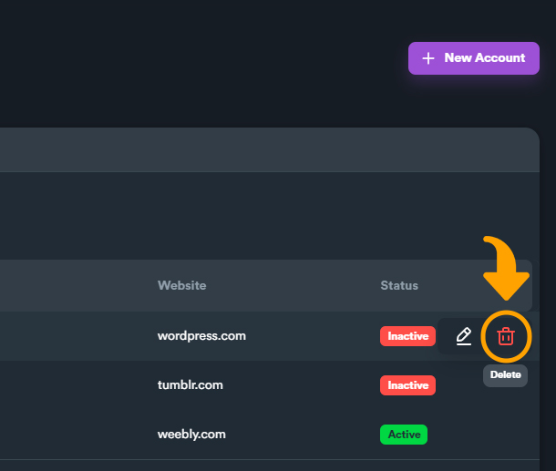

# Managing accounts

### Accounts Screen Overview

On this screen you will find a table that displays all created accounts and some details for each account.

<figure><figcaption>
All accounts inside account bucket
</figcaption></figure>

Below is the list of available information for each account.

**Blog Address:** the blog address (URL) that this account is registered on.

**Username:** username of the account.

**Password:** password of the account.

**Email:** email used to register the account.

**Website:** website (domain) that this account is used.

**Active:** if an account is active, it will be used the next time you use the account bucket on your campaigns. If an account is not active, the account will not be used.


When you are using an account bucket on a campaign and there is no active account for a website, a new account for this site is created automatically.


### Add account

1\) Click "**New Account**" to open account creation window.

<figure><figcaption></figcaption></figure>

2\) Fill all required account information.

<figure><figcaption>
Fill all account information like username, password, email etc.
</figcaption></figure>


From "**Website**" you select for which website you want to use account information (**username, password, email**). Each account is linked to one website.



If you disable "**Account active**" then the account will not be used on a campaign. This is useful when you want to have several accounts inside an account bucket but you only want to use certain ones on specific situations.


### Delete Account

You can hover any account (row from table) from the table and click "**Delete**" or you can select multiple accounts (using check boxes on the left) and delete all selected accounts.

<figure><figcaption>
Hover button "Delete" appears while you hover your mouse over a row on table
</figcaption></figure>
