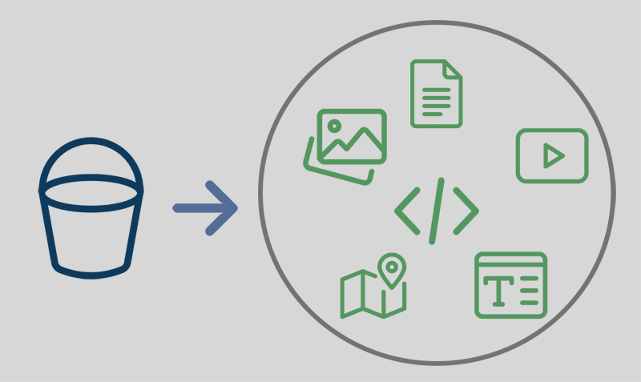

# 📘 Content Buckets

### Introduction

Content bucket is a collection different types of content that SEO NEO uses in order to create posts in different websites. A content bucket can include different content types including:

* Articles
* Image URLs
* Video URLs
* Titles
* Short Descriptions
* Google embedded code (ex. Google Maps)

<figure><figcaption>
Each content bucket can include many entries and different types of content (like images, videos, text etc.)
</figcaption></figure>


Each content bucket contains multiple articles, text bodies, titles, rich content (images, videos, embedded code) entries. This makes campaign creation easier to manage and faster to create.

