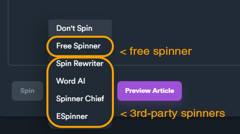

# Adding content

When you create a new content bucket, it's content is empty. In order to fill it with content, you will need to edit the bucket, by clicking "**Edit**" on hover button.

<figure><figcaption></figcaption></figure>

There are three different ways to add content:

**1) Import**

You can import content from file(s) or other content bucket that already includes content.

**2) Generate**

You can generate content using our free built-in builders, or 3rd party APIs.

**3) Add**

You can add content manually.

<figure><figcaption>
Use import, Generate and Add to insert content into content bucket.
</figcaption></figure>

### Adding different content types

Each content bucket can have multiple content entries from different [**content type**](content-types.md). You can navigate on different content categories and add content on each category separately.

<figure><figcaption>
Navigate between content types using tabs.
</figcaption></figure>

In the following example we will add a new article inside our content bucket.

1\) Click "**Article**" on content type tab.

<figure><figcaption></figcaption></figure>

2\) Click "**Add Article**" to open article form.

<figure><figcaption></figcaption></figure>

3\) Insert all required text on article editor and click "**Save**". Each content type has it's own editor depending on required data. In this example we add an article so we see the full article editor.

<figure><figcaption></figcaption></figure>


Different content types require different data entry. Refer to [**content types**](content-types.md) for more information.


### Article Editor

Article editor is where you can create and edit articles that which are stored inside content buckets. Other content types like short descriptions, bios etc have only a simple text form but articles can include rich content and formatted text.


Where you write article title and article body, it is preferred to use [**spintax format**](../../additional-information/glossary/spintax-format.md), which makes you title to include different variations. If you don't use spintax format, your article will get posted as it is.


Below we can see the basic section of article editor.

<figure><figcaption>
Article editor basic sections
</figcaption></figure>

#### 1) Article Title

This is where you put your article title. You can also insert default spun title by clicking "**Default Value**".

#### 2) Short Codes

Short codes are special tags that you insert inside article body. These tags make forces SEO NEO to include keyword, rich content or embedded code from your campaign settings.

If you don't include any short code, keywords will be places at random positions (defined from your campaign campaign settings). If you include short codes, you set specific positions inside article body where you want keywords to appear.


Using "**any keyword**" will randomly select an available keyword from your campaign.


#### 3) Article Body

This is where you write your article body. You can use editor buttons to format your text, insert links, images etc.&#x20;

#### 4) Spin

You can spin your article using one of the available spinners. Spinning your article will take your article text and create a new one in [**spintax format**](../../additional-information/glossary/spintax-format.md).  This is highly recommended because it creates different variations from the same article.

To spin your article, select one of the available spinners and then click "**Spin**".

<figure><figcaption>
Click on menu to select a spinner.
</figcaption></figure>

SEO NEO includes a free spinner, but you can also use any 3rd-party supported spinner. To use a 3rd-party spinner, you will need to set your credentials (API keys etc.) from [**spinner settings**](../settings/third-party-api.md#spinner)**.**

<figure><figcaption>
Available spinners
</figcaption></figure>

Below is an example of a basic article text that gets "spinned" using SEO NEO's built-in free spinner. As you can see, although oour original text was very small and simple, after spinning, we got many different variations.

| Original article text                     | Spintax format generated from free spinner                                                                                                                                                                                        |
| ----------------------------------------- | --------------------------------------------------------------------------------------------------------------------------------------------------------------------------------------------------------------------------------- |
| this is a very small text article example | this {is a very\|is an extremely\|is a really} {small\|little\|tiny\|modest\|smaller\|compact} {text\|textual content} {article\|post\|write-up\|report\|short article\|posting} {example\|instance\|illustration\|case in point} |

#### 5) Preview Article

### Adding Short Description

### Adding Bio

### Adding Rich Content

### Adding Blog Details

