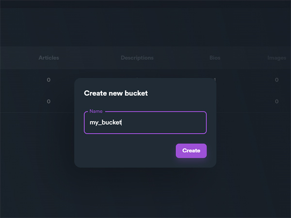

# Creating a content bucket

To create a new content bucket:

1\) Navigate to Content Bucket from main menu

\[image]

2\) Click "**New Bucket**"

<figure><figcaption></figcaption></figure>

3\) Enter a name for your bucket and click "**Create**"

<figure><figcaption></figcaption></figure>

Now you have a new content bucket. Keep in mind that this content bucket is still empty, which means there is no content inside the bucket. To use this bucket on your campaigns you will need to fill it with some content like articles, image urls etc.
