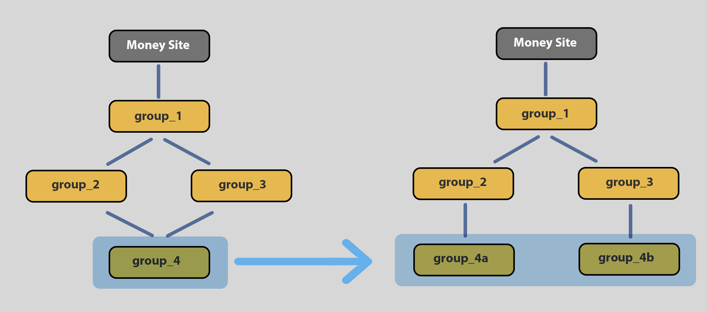

# Groups relationships

SEO NEO introduces an new way of displaying diagrams. The new diagram form is more compact and its more versatile if you understand they way it works.

A group (link group) can be connected with another groups that are located below or above them. Groups below of them are called **children** and groups above them are called **parents**.


A diagram a group can have **multiple children** but also **multiple parents**.


A group with multiple children is a very straightforward idea but a group with multiple parents may be confusing at first. Below we will explain how this works.

### Understanding multiple parents

A group with multiple parents is like being multiple groups. This means that if you have a group_A_ connected on two parents, the result is like having two groups inside group\_A.

On the example below, on the left we see how diagram looks like and on the right side we see how diagram is really like under the hood.

On the example, **group\_4** seems like a single group, but because it has two parents, in reality its two groups (**group\_4a** _and_ **group\_4b**). These two groups are **completely different** groups.

<figure><figcaption>
Left side: how diagram looks. Right side: how diagram is under the hood.
</figcaption></figure>


As a rule of thumb, if a group has **N** number of parents, then this group has **N** instances under the hood.


This may seem more complex to understand as a concept but makes a diagram much more compact (you need less groups to describe a much bigger diagram).
