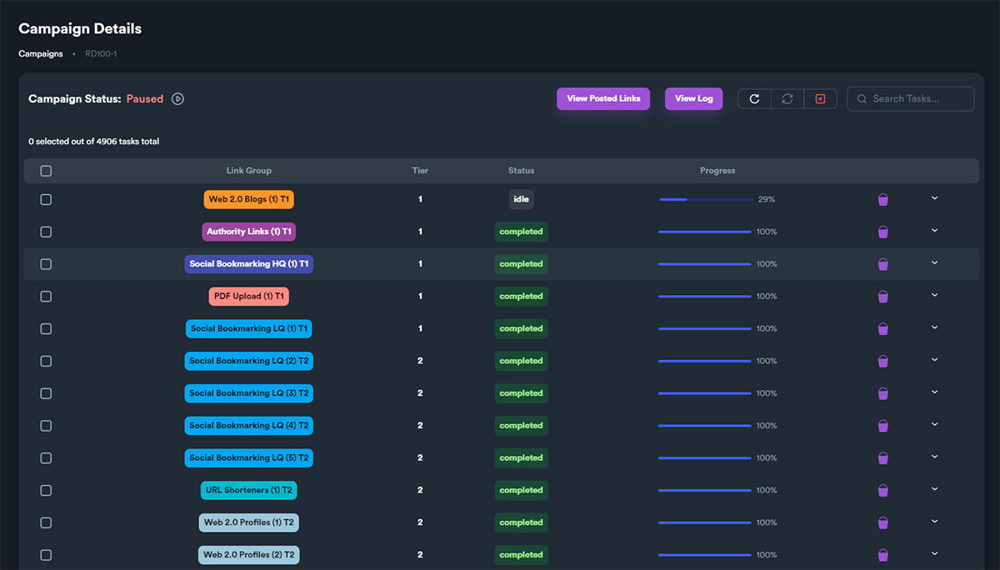

# Your Campaign Results

To view your campaign details, click on Campaigns from main module and click on "**Details**" hover button (that shows when you hover over a campaign).

<figure><figcaption></figcaption></figure>

By clicking on this button you will get a very detailed view of all campaign details, including its groups, and status for each group separately.

<figure><figcaption></figcaption></figure>

### Campaign Details - Overview

From this view you can get basic information on each group of your campaign. This view is different for each campaign and it depends on the diagram you have selected when you created the campaign.

<figure><figcaption></figcaption></figure>

* **Link group**\
  The type of link group. For more info on link group types, [**read this section**](../documentation/diagram-editor/link-group-types.md) of the documentation.
* **Tier**\
  Tier number of each group (which is the depth of each link group on the diagram). For more info diagram tiers, [**read this section**](../additional-information/glossary/tiers.md) of the documentation.
* **Status**\
  The status of each group. This indicates what is the current state of each group (**idle, running, completed**)&#x20;
* **Progress**\
  Progress status of the link group (as a % percentage value). A link group that is 100% is a group that is finished.
* **Account bucket**\
  On the right side of each group there is a bucket (indicating the account bucket). If you hover account bucket icon you can see a tooltip about which account bucket has been assigned to this group.

<figure><figcaption>
Account bucket info (hover the bucket to get details)
</figcaption></figure>

### Campaign Details - Task Details

Each link group has different tasks. For a detailed view of each task for each group, click on the down arrow on the right side. This will expand/collapse group task with a detailed view for each task.

<figure><figcaption></figcaption></figure>

<figure><figcaption></figcaption></figure>

* **Site URL**\
  This is the website that the task run. When you include a link group on your campaigns, all supported websites are selected by default. To select specific websites of each group when you create a campaign, use **Sites to Post**. For more info about **Sites to Post** [**read this section**](https://docs.seoneo.io/tutorials/creating-your-1st-campaign/creating-your-campaign/3-groups#sites-to-post) of the documentation.
* **D.A.**\
  This is the Domain Authority of each website.
* **Username**\
  This is the username SEO Neo used to register/login for this website (defined by selected Account Template).
* **Password**\
  This is the password SEO Neo used to register/login for this website (defined by selected Account Template).
* **Email**\
  This is the email SEO Neo used to register/login for this website (defined by selected Account Template).
* **Status**\
  The status of the task.&#x20;
* **Submitted URL**\
  This is the generated URL after the creation of the post. To view all generated URL of your campaign, use "[**View Posted Links**](your-campaign-results.md#view-posted-links)" (more info below).
* **Task Logs**\
  SEO Neo keeps detailed logs for each  task while automating the whole process for the campaign. To view each log, click on the "**eye**" button of a task.


To **copy** any field from the task details grid, click on any element and the field will be copied on your clipboard.


if you want to terminate/kill, retry or rerun tasks, you can multiple-select different tasks and use the buttons on the top-right.

<figure><figcaption></figcaption></figure>

### View Posted Links

To view all generated URL of your campaign, click on **View Posted Links** button.

<figure><figcaption></figcaption></figure>

A new pop-up window will open with different settings. These settings are basically filters on which tasks you want to view posted links for.

You can select tiers, group types and even hide credentials from posted links.

<figure><figcaption></figcaption></figure>

After setting your filters, click on **Confirm** button to view posted links.

<figure><figcaption></figcaption></figure>

### View Campaign Log

To view your campaign's log click on View Log button. This is different from task log mention above, as this includes log details for the whole campaign.

<figure><figcaption></figcaption></figure>
